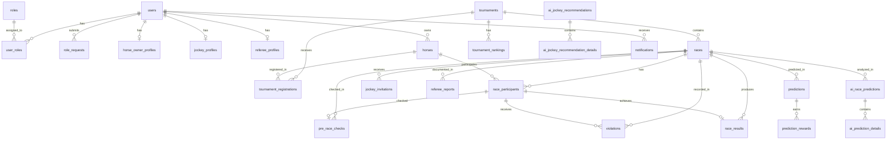
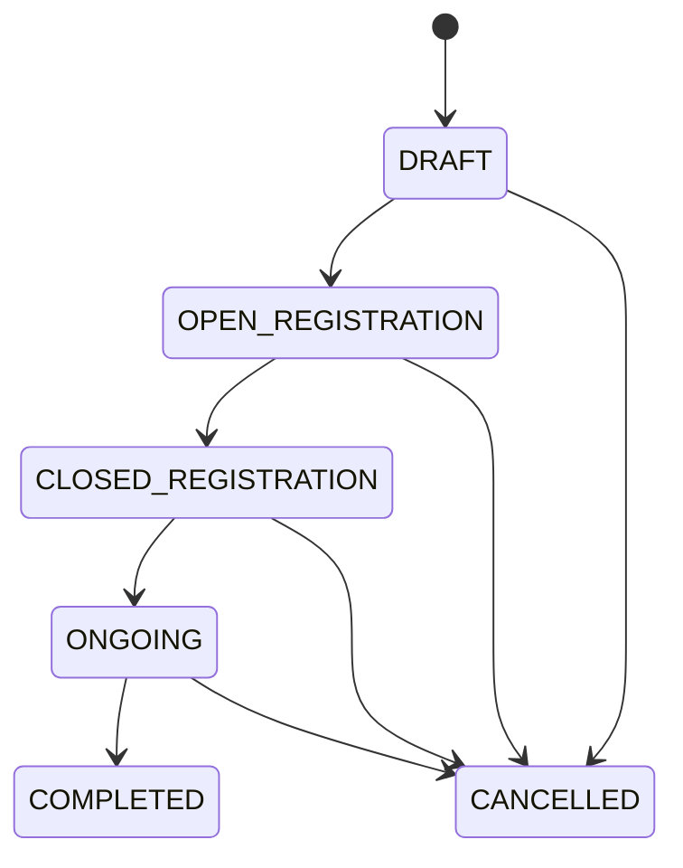
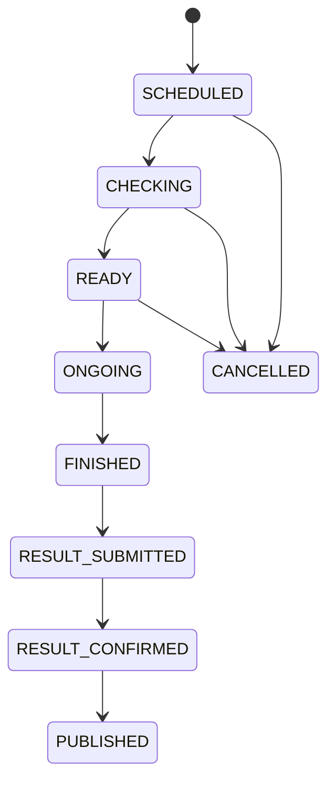
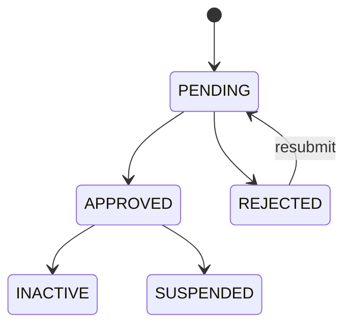
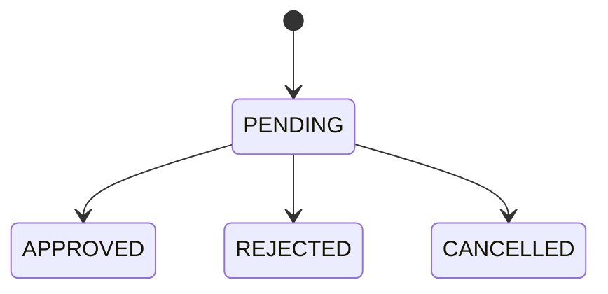
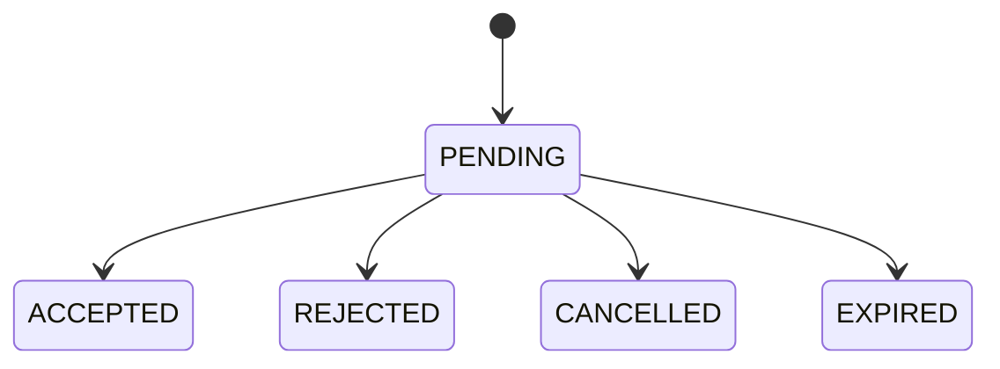

# Database Design - ERD & SQL

## 1. Entity Relationship Diagram



## 2. Status Lifecycle Diagrams

### 2.1. Tournament Lifecycle


### 2.2. Race Lifecycle


### 2.3. Horse Status


### 2.4. Role Request Status


### 2.5. Jockey Invitation Status


## 3. SQL Schema (MVP - 20 Tables)

### 3.1. Core User Tables

```sql
-- =============================================
-- TABLE: users
-- =============================================
CREATE TABLE users (
    id BIGINT PRIMARY KEY IDENTITY(1,1),
    full_name VARCHAR(150) NOT NULL,
    email VARCHAR(150) NOT NULL,
    password_hash VARCHAR(255) NOT NULL,
    phone VARCHAR(30) NULL,
    avatar_url VARCHAR(500) NULL,
    date_of_birth DATE NULL,
    gender VARCHAR(20) NULL,
    address VARCHAR(255) NULL,
    status VARCHAR(30) NOT NULL DEFAULT 'ACTIVE',
    email_verified BIT NOT NULL DEFAULT 0,
    last_login_at DATETIME NULL,
    created_at DATETIME NOT NULL DEFAULT GETDATE(),
    updated_at DATETIME NULL,
    deleted_at DATETIME NULL
);

CREATE UNIQUE INDEX uq_users_email ON users(email);
CREATE INDEX idx_users_status ON users(status);

-- =============================================
-- TABLE: roles
-- =============================================
CREATE TABLE roles (
    id BIGINT PRIMARY KEY IDENTITY(1,1),
    name VARCHAR(50) NOT NULL,
    description VARCHAR(255) NULL
);

CREATE UNIQUE INDEX uq_roles_name ON roles(name);

-- Seed data
INSERT INTO roles (name, description) VALUES
('ADMIN', 'System administrator'),
('SPECTATOR', 'Default viewer role'),
('HORSE_OWNER', 'Horse owner role'),
('JOCKEY', 'Jockey role'),
('REFEREE', 'Race referee role');

-- =============================================
-- TABLE: user_roles
-- =============================================
CREATE TABLE user_roles (
    id BIGINT PRIMARY KEY IDENTITY(1,1),
    user_id BIGINT NOT NULL REFERENCES users(id),
    role_id BIGINT NOT NULL REFERENCES roles(id),
    status VARCHAR(30) NOT NULL DEFAULT 'ACTIVE',
    assigned_at DATETIME NOT NULL DEFAULT GETDATE(),
    assigned_by BIGINT NULL REFERENCES users(id),
    removed_at DATETIME NULL,
    removed_by BIGINT NULL REFERENCES users(id),
    CONSTRAINT uq_user_role UNIQUE(user_id, role_id)
);

CREATE INDEX idx_user_roles_user ON user_roles(user_id);

-- =============================================
-- TABLE: role_requests
-- =============================================
CREATE TABLE role_requests (
    id BIGINT PRIMARY KEY IDENTITY(1,1),
    user_id BIGINT NOT NULL REFERENCES users(id),
    requested_role VARCHAR(50) NOT NULL,
    status VARCHAR(30) NOT NULL DEFAULT 'PENDING',
    reason TEXT NULL,
    evidence_url VARCHAR(500) NULL,
    admin_note TEXT NULL,
    reviewed_by BIGINT NULL REFERENCES users(id),
    reviewed_at DATETIME NULL,
    created_at DATETIME NOT NULL DEFAULT GETDATE(),
    updated_at DATETIME NULL
);

CREATE INDEX idx_role_requests_user ON role_requests(user_id);
CREATE INDEX idx_role_requests_status ON role_requests(status);
```

### 3.2. Profile Tables

```sql
-- =============================================
-- TABLE: horse_owner_profiles
-- =============================================
CREATE TABLE horse_owner_profiles (
    id BIGINT PRIMARY KEY IDENTITY(1,1),
    user_id BIGINT NOT NULL REFERENCES users(id),
    stable_name VARCHAR(150) NULL,
    organization_name VARCHAR(150) NULL,
    license_number VARCHAR(100) NULL,
    experience_years INT NOT NULL DEFAULT 0,
    bio TEXT NULL,
    evidence_url VARCHAR(500) NULL,
    status VARCHAR(30) NOT NULL DEFAULT 'PENDING',
    rejection_reason TEXT NULL,
    approved_by BIGINT NULL REFERENCES users(id),
    approved_at DATETIME NULL,
    created_at DATETIME NOT NULL DEFAULT GETDATE(),
    updated_at DATETIME NULL,
    CONSTRAINT uq_owner_profile_user UNIQUE(user_id)
);

-- =============================================
-- TABLE: jockey_profiles
-- =============================================
CREATE TABLE jockey_profiles (
    id BIGINT PRIMARY KEY IDENTITY(1,1),
    user_id BIGINT NOT NULL REFERENCES users(id),
    license_number VARCHAR(100) NULL,
    height_cm DECIMAL(5,2) NULL,
    weight_kg DECIMAL(5,2) NULL,
    experience_years INT NOT NULL DEFAULT 0,
    riding_style VARCHAR(100) NULL,
    bio TEXT NULL,
    evidence_url VARCHAR(500) NULL,
    total_races INT NOT NULL DEFAULT 0,
    total_wins INT NOT NULL DEFAULT 0,
    status VARCHAR(30) NOT NULL DEFAULT 'PENDING',
    rejection_reason TEXT NULL,
    approved_by BIGINT NULL REFERENCES users(id),
    approved_at DATETIME NULL,
    created_at DATETIME NOT NULL DEFAULT GETDATE(),
    updated_at DATETIME NULL,
    CONSTRAINT uq_jockey_profile_user UNIQUE(user_id)
);

-- =============================================
-- TABLE: referee_profiles
-- =============================================
CREATE TABLE referee_profiles (
    id BIGINT PRIMARY KEY IDENTITY(1,1),
    user_id BIGINT NOT NULL REFERENCES users(id),
    license_number VARCHAR(100) NULL,
    certification VARCHAR(255) NULL,
    experience_years INT NOT NULL DEFAULT 0,
    bio TEXT NULL,
    evidence_url VARCHAR(500) NULL,
    status VARCHAR(30) NOT NULL DEFAULT 'PENDING',
    rejection_reason TEXT NULL,
    approved_by BIGINT NULL REFERENCES users(id),
    approved_at DATETIME NULL,
    created_at DATETIME NOT NULL DEFAULT GETDATE(),
    updated_at DATETIME NULL,
    CONSTRAINT uq_referee_profile_user UNIQUE(user_id)
);
```

### 3.3. Horse & Tournament Tables

```sql
-- =============================================
-- TABLE: horses
-- =============================================
CREATE TABLE horses (
    id BIGINT PRIMARY KEY IDENTITY(1,1),
    owner_id BIGINT NOT NULL REFERENCES users(id),
    name VARCHAR(150) NOT NULL,
    registration_code VARCHAR(100) NULL,
    breed VARCHAR(100) NULL,
    gender VARCHAR(20) NOT NULL,
    date_of_birth DATE NULL,
    color VARCHAR(50) NULL,
    height_cm DECIMAL(6,2) NULL,
    weight_kg DECIMAL(6,2) NULL,
    health_status VARCHAR(100) NULL,
    medical_note TEXT NULL,
    image_url VARCHAR(500) NULL,
    description TEXT NULL,
    status VARCHAR(30) NOT NULL DEFAULT 'PENDING',
    rejection_reason TEXT NULL,
    approved_by BIGINT NULL REFERENCES users(id),
    approved_at DATETIME NULL,
    created_at DATETIME NOT NULL DEFAULT GETDATE(),
    updated_at DATETIME NULL,
    deleted_at DATETIME NULL
);

CREATE UNIQUE INDEX uq_horses_reg_code ON horses(registration_code) WHERE registration_code IS NOT NULL;
CREATE INDEX idx_horses_owner ON horses(owner_id);
CREATE INDEX idx_horses_status ON horses(status);

-- =============================================
-- TABLE: tournaments
-- =============================================
CREATE TABLE tournaments (
    id BIGINT PRIMARY KEY IDENTITY(1,1),
    name VARCHAR(200) NOT NULL,
    code VARCHAR(100) NOT NULL,
    description TEXT NULL,
    location VARCHAR(255) NOT NULL,
    start_date DATE NOT NULL,
    end_date DATE NOT NULL,
    registration_start_at DATETIME NOT NULL,
    registration_end_at DATETIME NOT NULL,
    max_horses INT NULL,
    status VARCHAR(40) NOT NULL DEFAULT 'DRAFT',
    banner_url VARCHAR(500) NULL,
    rules TEXT NULL,
    created_by BIGINT NOT NULL REFERENCES users(id),
    created_at DATETIME NOT NULL DEFAULT GETDATE(),
    updated_at DATETIME NULL,
    deleted_at DATETIME NULL
);

CREATE UNIQUE INDEX uq_tournaments_code ON tournaments(code);
CREATE INDEX idx_tournaments_status ON tournaments(status);

-- =============================================
-- TABLE: races
-- =============================================
CREATE TABLE races (
    id BIGINT PRIMARY KEY IDENTITY(1,1),
    tournament_id BIGINT NOT NULL REFERENCES tournaments(id),
    name VARCHAR(200) NOT NULL,
    code VARCHAR(100) NOT NULL,
    round_name VARCHAR(100) NULL,
    race_number INT NULL,
    race_at DATETIME NOT NULL,
    distance_meter INT NOT NULL,
    track_name VARCHAR(150) NULL,
    track_condition VARCHAR(50) NULL,
    max_participants INT NOT NULL,
    min_participants INT NOT NULL DEFAULT 2,
    referee_id BIGINT NULL REFERENCES users(id),
    status VARCHAR(40) NOT NULL DEFAULT 'SCHEDULED',
    note TEXT NULL,
    created_by BIGINT NOT NULL REFERENCES users(id),
    created_at DATETIME NOT NULL DEFAULT GETDATE(),
    updated_at DATETIME NULL,
    deleted_at DATETIME NULL
);

CREATE UNIQUE INDEX uq_races_code ON races(code);
CREATE INDEX idx_races_tournament ON races(tournament_id);
CREATE INDEX idx_races_referee ON races(referee_id);
CREATE INDEX idx_races_race_at ON races(race_at);
CREATE INDEX idx_races_status ON races(status);

-- =============================================
-- TABLE: tournament_registrations
-- =============================================
CREATE TABLE tournament_registrations (
    id BIGINT PRIMARY KEY IDENTITY(1,1),
    tournament_id BIGINT NOT NULL REFERENCES tournaments(id),
    horse_id BIGINT NOT NULL REFERENCES horses(id),
    owner_id BIGINT NOT NULL REFERENCES users(id),
    status VARCHAR(30) NOT NULL DEFAULT 'PENDING',
    note TEXT NULL,
    rejection_reason TEXT NULL,
    approved_by BIGINT NULL REFERENCES users(id),
    approved_at DATETIME NULL,
    created_at DATETIME NOT NULL DEFAULT GETDATE(),
    updated_at DATETIME NULL,
    CONSTRAINT uq_tournament_horse UNIQUE(tournament_id, horse_id)
);
```

### 3.4. Race Operation Tables

```sql
-- =============================================
-- TABLE: jockey_invitations
-- =============================================
CREATE TABLE jockey_invitations (
    id BIGINT PRIMARY KEY IDENTITY(1,1),
    race_id BIGINT NOT NULL REFERENCES races(id),
    horse_id BIGINT NOT NULL REFERENCES horses(id),
    owner_id BIGINT NOT NULL REFERENCES users(id),
    jockey_id BIGINT NOT NULL REFERENCES users(id),
    message TEXT NULL,
    status VARCHAR(30) NOT NULL DEFAULT 'PENDING',
    response_message TEXT NULL,
    responded_at DATETIME NULL,
    expired_at DATETIME NULL,
    created_at DATETIME NOT NULL DEFAULT GETDATE(),
    updated_at DATETIME NULL
);

CREATE INDEX idx_invitations_jockey ON jockey_invitations(jockey_id);
CREATE INDEX idx_invitations_race ON jockey_invitations(race_id);
CREATE INDEX idx_invitations_status ON jockey_invitations(status);

-- =============================================
-- TABLE: race_participants
-- =============================================
CREATE TABLE race_participants (
    id BIGINT PRIMARY KEY IDENTITY(1,1),
    race_id BIGINT NOT NULL REFERENCES races(id),
    horse_id BIGINT NOT NULL REFERENCES horses(id),
    owner_id BIGINT NOT NULL REFERENCES users(id),
    jockey_id BIGINT NULL REFERENCES users(id),
    invitation_id BIGINT NULL REFERENCES jockey_invitations(id),
    start_number INT NULL,
    lane_number INT NULL,
    weight_carried_kg DECIMAL(5,2) NULL,
    confirmation_status VARCHAR(30) NOT NULL DEFAULT 'PENDING',
    check_status VARCHAR(30) NOT NULL DEFAULT 'NOT_CHECKED',
    check_note TEXT NULL,
    status VARCHAR(30) NOT NULL DEFAULT 'REGISTERED',
    created_at DATETIME NOT NULL DEFAULT GETDATE(),
    updated_at DATETIME NULL,
    CONSTRAINT uq_race_horse UNIQUE(race_id, horse_id)
);

CREATE INDEX idx_participants_race ON race_participants(race_id);

-- =============================================
-- TABLE: pre_race_checks
-- =============================================
CREATE TABLE pre_race_checks (
    id BIGINT PRIMARY KEY IDENTITY(1,1),
    race_id BIGINT NOT NULL REFERENCES races(id),
    participant_id BIGINT NOT NULL REFERENCES race_participants(id),
    referee_id BIGINT NOT NULL REFERENCES users(id),
    horse_identity_ok BIT NOT NULL DEFAULT 0,
    jockey_identity_ok BIT NOT NULL DEFAULT 0,
    equipment_ok BIT NOT NULL DEFAULT 0,
    health_ok BIT NOT NULL DEFAULT 0,
    weight_ok BIT NOT NULL DEFAULT 0,
    result VARCHAR(30) NOT NULL,
    note TEXT NULL,
    checked_at DATETIME NOT NULL DEFAULT GETDATE(),
    created_at DATETIME NOT NULL DEFAULT GETDATE(),
    CONSTRAINT uq_race_participant_check UNIQUE(race_id, participant_id)
);

-- =============================================
-- TABLE: violations
-- =============================================
CREATE TABLE violations (
    id BIGINT PRIMARY KEY IDENTITY(1,1),
    race_id BIGINT NOT NULL REFERENCES races(id),
    participant_id BIGINT NULL REFERENCES race_participants(id),
    violation_type_id BIGINT NULL,
    reported_by BIGINT NOT NULL REFERENCES users(id),
    description TEXT NOT NULL,
    penalty VARCHAR(150) NULL,
    severity VARCHAR(30) NULL,
    occurred_at DATETIME NULL,
    created_at DATETIME NOT NULL DEFAULT GETDATE(),
    updated_at DATETIME NULL
);

-- =============================================
-- TABLE: referee_reports
-- =============================================
CREATE TABLE referee_reports (
    id BIGINT PRIMARY KEY IDENTITY(1,1),
    race_id BIGINT NOT NULL REFERENCES races(id),
    referee_id BIGINT NOT NULL REFERENCES users(id),
    title VARCHAR(200) NULL,
    summary TEXT NOT NULL,
    ai_summary TEXT NULL,
    status VARCHAR(30) NOT NULL DEFAULT 'DRAFT',
    submitted_at DATETIME NULL,
    confirmed_by BIGINT NULL REFERENCES users(id),
    confirmed_at DATETIME NULL,
    rejection_reason TEXT NULL,
    created_at DATETIME NOT NULL DEFAULT GETDATE(),
    updated_at DATETIME NULL,
    CONSTRAINT uq_race_referee_report UNIQUE(race_id, referee_id)
);
```

### 3.5. Result & Ranking Tables

```sql
-- =============================================
-- TABLE: race_results
-- =============================================
CREATE TABLE race_results (
    id BIGINT PRIMARY KEY IDENTITY(1,1),
    race_id BIGINT NOT NULL REFERENCES races(id),
    participant_id BIGINT NOT NULL REFERENCES race_participants(id),
    position INT NULL,
    finish_time_seconds DECIMAL(10,3) NULL,
    result_status VARCHAR(30) NOT NULL,
    points INT NOT NULL DEFAULT 0,
    prize_amount DECIMAL(12,2) NOT NULL DEFAULT 0,
    note TEXT NULL,
    submitted_by BIGINT NOT NULL REFERENCES users(id),
    submitted_at DATETIME NOT NULL DEFAULT GETDATE(),
    confirmed_by BIGINT NULL REFERENCES users(id),
    confirmed_at DATETIME NULL,
    published_at DATETIME NULL,
    status VARCHAR(30) NOT NULL DEFAULT 'DRAFT',
    created_at DATETIME NOT NULL DEFAULT GETDATE(),
    updated_at DATETIME NULL,
    CONSTRAINT uq_race_participant_result UNIQUE(race_id, participant_id)
);

CREATE INDEX idx_results_race ON race_results(race_id);

-- =============================================
-- TABLE: tournament_rankings
-- =============================================
CREATE TABLE tournament_rankings (
    id BIGINT PRIMARY KEY IDENTITY(1,1),
    tournament_id BIGINT NOT NULL REFERENCES tournaments(id),
    horse_id BIGINT NOT NULL REFERENCES horses(id),
    owner_id BIGINT NOT NULL REFERENCES users(id),
    total_races INT NOT NULL DEFAULT 0,
    total_wins INT NOT NULL DEFAULT 0,
    total_points INT NOT NULL DEFAULT 0,
    total_prize DECIMAL(12,2) NOT NULL DEFAULT 0,
    rank_position INT NULL,
    last_updated_at DATETIME NOT NULL DEFAULT GETDATE(),
    CONSTRAINT uq_tournament_horse_rank UNIQUE(tournament_id, horse_id)
);

-- =============================================
-- TABLE: predictions
-- =============================================
CREATE TABLE predictions (
    id BIGINT PRIMARY KEY IDENTITY(1,1),
    race_id BIGINT NOT NULL REFERENCES races(id),
    spectator_id BIGINT NOT NULL REFERENCES users(id),
    prediction_type VARCHAR(30) NOT NULL,
    predicted_winner_id BIGINT NULL REFERENCES race_participants(id),
    predicted_second_id BIGINT NULL REFERENCES race_participants(id),
    predicted_third_id BIGINT NULL REFERENCES race_participants(id),
    status VARCHAR(30) NOT NULL DEFAULT 'PENDING',
    points_earned INT NOT NULL DEFAULT 0,
    evaluated_at DATETIME NULL,
    created_at DATETIME NOT NULL DEFAULT GETDATE(),
    updated_at DATETIME NULL,
    CONSTRAINT uq_race_spectator_pred UNIQUE(race_id, spectator_id)
);

CREATE INDEX idx_predictions_race ON predictions(race_id);
CREATE INDEX idx_predictions_spectator ON predictions(spectator_id);

-- =============================================
-- TABLE: notifications
-- =============================================
CREATE TABLE notifications (
    id BIGINT PRIMARY KEY IDENTITY(1,1),
    user_id BIGINT NOT NULL REFERENCES users(id),
    title VARCHAR(200) NOT NULL,
    message TEXT NOT NULL,
    type VARCHAR(50) NOT NULL,
    reference_type VARCHAR(50) NULL,
    reference_id BIGINT NULL,
    is_read BIT NOT NULL DEFAULT 0,
    read_at DATETIME NULL,
    created_at DATETIME NOT NULL DEFAULT GETDATE()
);

CREATE INDEX idx_notifications_user ON notifications(user_id);
CREATE INDEX idx_notifications_read ON notifications(is_read);
```

### 3.6. Seed Data

```sql
-- Admin account (password: change-me, must be BCrypt hashed)
INSERT INTO users (full_name, email, password_hash, status, email_verified)
VALUES ('System Admin', 'admin@horse-racing.local',
        '$2a$10$...hashed...', 'ACTIVE', 1);

-- Assign ADMIN + SPECTATOR roles to admin
INSERT INTO user_roles (user_id, role_id, status, assigned_at)
SELECT u.id, r.id, 'ACTIVE', GETDATE()
FROM users u, roles r
WHERE u.email = 'admin@horse-racing.local'
AND r.name IN ('ADMIN', 'SPECTATOR');
```
