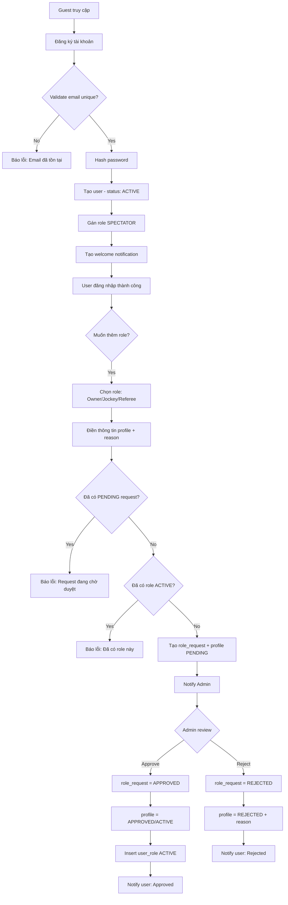
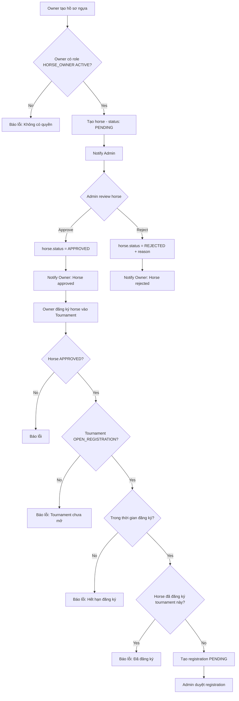
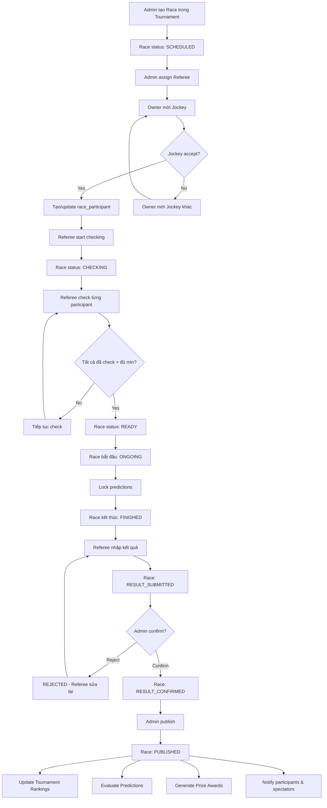
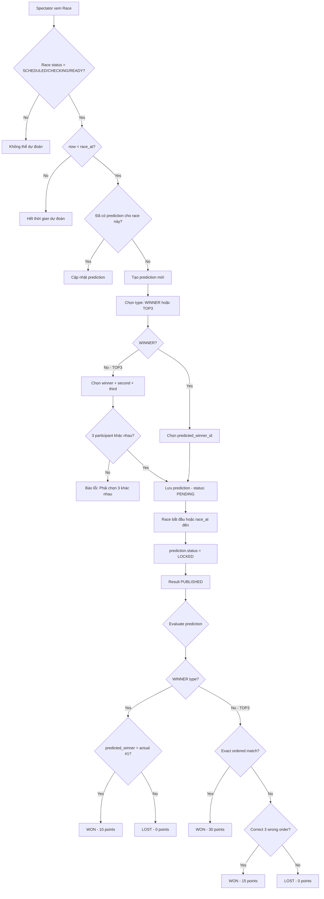
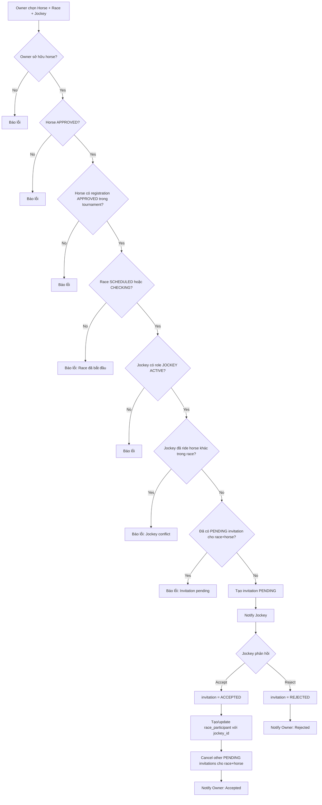

# Logic Flowcharts

## 1. User Registration & Role Request Flow

```mermaid
flowchart TD
    A[Guest truy cập] --> B[Đăng ký tài khoản]
    B --> C{Validate email unique?}
    C -->|No| D[Báo lỗi: Email đã tồn tại]
    C -->|Yes| E[Hash password]
    E --> F[Tạo user - status: ACTIVE]
    F --> G[Gán role SPECTATOR]
    G --> H[Tạo welcome notification]
    H --> I[User đăng nhập thành công]
    
    I --> J{Muốn thêm role?}
    J -->|Yes| K[Chọn role: Owner/Jockey/Referee]
    K --> L[Điền thông tin profile + reason]
    L --> M{Đã có PENDING request?}
    M -->|Yes| N[Báo lỗi: Request đang chờ duyệt]
    M -->|No| O{Đã có role ACTIVE?}
    O -->|Yes| P[Báo lỗi: Đã có role này]
    O -->|No| Q[Tạo role_request + profile PENDING]
    Q --> R[Notify Admin]
    
    R --> S{Admin review}
    S -->|Approve| T[role_request = APPROVED]
    T --> U[profile = APPROVED/ACTIVE]
    U --> V[Insert user_role ACTIVE]
    V --> W[Notify user: Approved]
    
    S -->|Reject| X[role_request = REJECTED]
    X --> Y[profile = REJECTED + reason]
    Y --> Z[Notify user: Rejected]
```

## 2. Horse Management Flow

```mermaid
flowchart TD
    A[Owner tạo hồ sơ ngựa] --> B{Owner có role HORSE_OWNER ACTIVE?}
    B -->|No| C[Báo lỗi: Không có quyền]
    B -->|Yes| D[Tạo horse - status: PENDING]
    D --> E[Notify Admin]
    
    E --> F{Admin review horse}
    F -->|Approve| G[horse.status = APPROVED]
    G --> H[Notify Owner: Horse approved]
    F -->|Reject| I[horse.status = REJECTED + reason]
    I --> J[Notify Owner: Horse rejected]
    
    H --> K[Owner đăng ký horse vào Tournament]
    K --> L{Horse APPROVED?}
    L -->|No| M[Báo lỗi]
    L -->|Yes| N{Tournament OPEN_REGISTRATION?}
    N -->|No| O[Báo lỗi: Tournament chưa mở]
    N -->|Yes| P{Trong thời gian đăng ký?}
    P -->|No| Q[Báo lỗi: Hết hạn đăng ký]
    P -->|Yes| R{Horse đã đăng ký tournament này?}
    R -->|Yes| S[Báo lỗi: Đã đăng ký]
    R -->|No| T[Tạo registration PENDING]
    T --> U[Admin duyệt registration]
```

## 3. Race Operation Flow (Core Workflow)

```mermaid
flowchart TD
    A[Admin tạo Race trong Tournament] --> B[Race status: SCHEDULED]
    B --> C[Admin assign Referee]
    
    C --> D[Owner mời Jockey]
    D --> E{Jockey accept?}
    E -->|Yes| F[Tạo/update race_participant]
    E -->|No| G[Owner mời Jockey khác]
    G --> D
    
    F --> H[Referee start checking]
    H --> I[Race status: CHECKING]
    I --> J[Referee check từng participant]
    J --> K{Tất cả đã check + đủ min?}
    K -->|No| L[Tiếp tục check]
    L --> J
    K -->|Yes| M[Race status: READY]
    
    M --> N[Race bắt đầu: ONGOING]
    N --> O[Lock predictions]
    O --> P[Race kết thúc: FINISHED]
    
    P --> Q[Referee nhập kết quả]
    Q --> R[Race: RESULT_SUBMITTED]
    R --> S{Admin confirm?}
    S -->|Reject| T[REJECTED - Referee sửa lại]
    T --> Q
    S -->|Confirm| U[Race: RESULT_CONFIRMED]
    U --> V[Admin publish]
    V --> W[Race: PUBLISHED]
    
    W --> X[Update Tournament Rankings]
    W --> Y[Evaluate Predictions]
    W --> Z[Generate Prize Awards]
    W --> AA[Notify participants & spectators]
```

## 4. Prediction Flow

```mermaid
flowchart TD
    A[Spectator xem Race] --> B{Race status = SCHEDULED/CHECKING/READY?}
    B -->|No| C[Không thể dự đoán]
    B -->|Yes| D{now < race_at?}
    D -->|No| E[Hết thời gian dự đoán]
    D -->|Yes| F{Đã có prediction cho race này?}
    F -->|Yes| G[Cập nhật prediction]
    F -->|No| H[Tạo prediction mới]
    
    H --> I[Chọn type: WINNER hoặc TOP3]
    I --> J{WINNER?}
    J -->|Yes| K[Chọn predicted_winner_id]
    J -->|No - TOP3| L[Chọn winner + second + third]
    L --> M{3 participant khác nhau?}
    M -->|No| N[Báo lỗi: Phải chọn 3 khác nhau]
    M -->|Yes| O[Lưu prediction - status: PENDING]
    K --> O
    
    O --> P[Race bắt đầu hoặc race_at đến]
    P --> Q[prediction.status = LOCKED]
    
    Q --> R[Result PUBLISHED]
    R --> S{Evaluate prediction}
    
    S --> T{WINNER type?}
    T -->|Yes| U{predicted_winner = actual #1?}
    U -->|Yes| V[WON - 10 points]
    U -->|No| W[LOST - 0 points]
    
    T -->|No - TOP3| X{Exact ordered match?}
    X -->|Yes| Y[WON - 30 points]
    X -->|No| Z{Correct 3 wrong order?}
    Z -->|Yes| AA[WON - 15 points]
    Z -->|No| AB[LOST - 0 points]
```

## 5. Jockey Invitation Flow

```mermaid
flowchart TD
    A[Owner chọn Horse + Race + Jockey] --> B{Owner sở hữu horse?}
    B -->|No| C[Báo lỗi]
    B -->|Yes| D{Horse APPROVED?}
    D -->|No| E[Báo lỗi]
    D -->|Yes| F{Horse có registration APPROVED trong tournament?}
    F -->|No| G[Báo lỗi]
    F -->|Yes| H{Race SCHEDULED hoặc CHECKING?}
    H -->|No| I[Báo lỗi: Race đã bắt đầu]
    H -->|Yes| J{Jockey có role JOCKEY ACTIVE?}
    J -->|No| K[Báo lỗi]
    J -->|Yes| L{Jockey đã ride horse khác trong race?}
    L -->|Yes| M[Báo lỗi: Jockey conflict]
    L -->|No| N{Đã có PENDING invitation cho race+horse?}
    N -->|Yes| O[Báo lỗi: Invitation pending]
    N -->|No| P[Tạo invitation PENDING]
    P --> Q[Notify Jockey]
    
    Q --> R{Jockey phản hồi}
    R -->|Accept| S[invitation = ACCEPTED]
    S --> T[Tạo/update race_participant với jockey_id]
    T --> U[Cancel other PENDING invitations cho race+horse]
    U --> V[Notify Owner: Accepted]
    
    R -->|Reject| W[invitation = REJECTED]
    W --> X[Notify Owner: Rejected]
```
