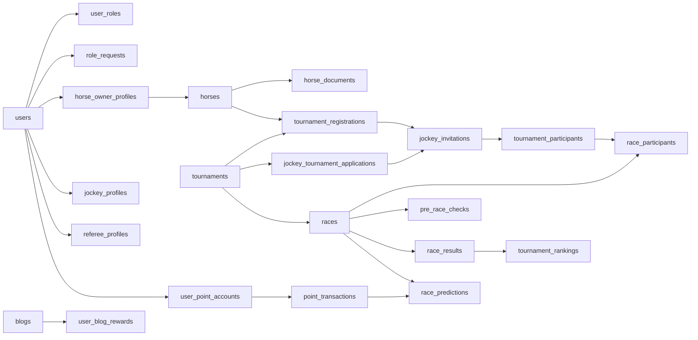

# Domain Model

## 1. Domain Groups

### Identity and access

- `users`: account profile, credential status, email verification state.
- `roles`: role catalog.
- `user_roles`: active role assignments.
- `user_role_history`: audit trail for role changes.
- `role_requests`: workflow for requesting owner, jockey, or referee access.
- role-specific profiles: `horse_owner_profiles`, `jockey_profiles`, `referee_profiles`.

### Horse and tournament management

- `horses`: horse profile, owner link, health/approval status.
- `horse_documents`: document evidence uploaded by owners.
- `tournaments`: championship/tournament metadata and lifecycle.
- `tournament_prize_tiers`: configured prize positions.
- `tournament_registrations`: owner-horse registration requests.

### Championship participation

- `jockey_tournament_applications`: jockey application into a tournament/championship pool.
- `jockey_invitations`: owner-to-jockey contract invitations.
- `tournament_participants`: locked horse-jockey participants after contract acceptance and admin lock.

### Race operations

- `races`: scheduled race records under tournaments.
- `race_participants`: participants assigned to a race.
- `pre_race_checks`: referee inspection before a race.
- `violations`: race-day rule violations.
- `referee_reports`: incident and report packages.
- `race_results`: official result entries.
- `tournament_rankings`: ranking summary after results.

### Engagement and points

- `blogs`: public content managed by admins.
- `user_blog_rewards`: reward claims for blog reading.
- `user_daily_point_limits`: daily cap tracking.
- `user_point_accounts`: current point balance per user.
- `point_transactions`: immutable ledger of point movement.
- `point_settings`: admin-configurable point policy.
- `race_predictions`: spectator predictions.
- `prediction_settlement_jobs`: settlement retry/audit state.

## 2. Relationship Summary

## 3. Domain Boundary Principle

The racing domain is authoritative. Referee/admin workflows decide race status, participant validity, results, and rankings. Spectator prediction data reads from official race data but never changes official race operations.

Point transactions are ledger records. A feature that changes a user's points should create or reuse a point transaction instead of directly manipulating balance without business context.
