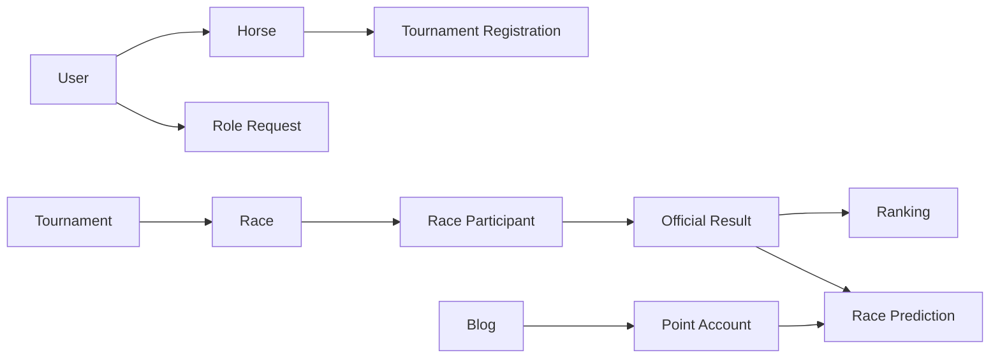

# Domain Model

## 1. Core domain groups

### Identity and access
- `users`
- `roles`
- `user_roles`
- `role_requests`
- role-specific profiles

### Racing management
- `horses`
- `tournaments`
- `tournament_registrations`
- `races`
- `race_participants`
- `jockey_invitations`

### Race operations
- `pre_race_checks`
- `violations`
- `referee_reports`
- `race_results`
- `tournament_rankings`

### Engagement
- `blogs`
- `user_blog_rewards`
- `user_point_accounts`
- `point_transactions`
- `race_predictions`
- `notifications`
- `ai_predictions`

## 2. Domain relationship

The racing domain is authoritative. Predictions only become evaluable after official results are published. Blog rewards only create points; they never affect official race operations.

## 3. Design principle

Keep official racing truth and spectator gameplay separate:

- official results come from referee/admin workflow,
- game points come from business rules,
- AI only adds context, not authority.

