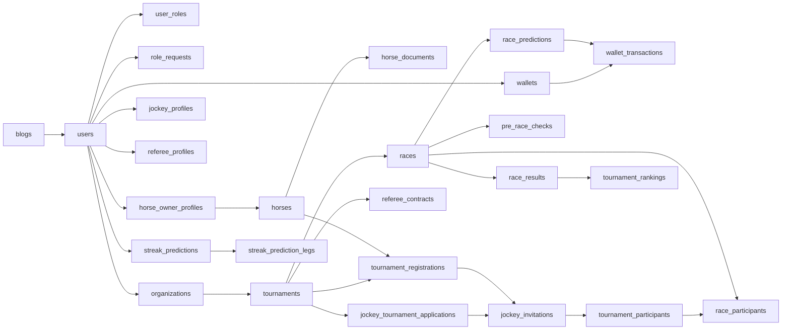

# Domain Model

## 1. Domain Groups

### Identity and access

- `users`: account profile, credential status, email verification state.
- `roles`: role catalog, including `ADMIN`, `SPECTATOR`, personal roles, and `ORGANIZER`.
- `user_roles`: active/inactive role assignments.
- `user_role_history`: audit trail for role changes.
- `role_requests`: workflow for requesting `HORSE_OWNER`, `JOCKEY`, or `REFEREE` access.
- role-specific profiles: `horse_owner_profiles`, `jockey_profiles`, `referee_profiles`.

### Organization and organizer governance

- `organizations`: KYB application and approved organizer account record.
- `tournaments.organization_id`: tournament ownership by one organization.
- `referee_contracts`: organizer-to-referee seasonal/work contract for a tournament.

Organizer is a business role, not a personal participation role. MVP has one owner account per organization and no staff/member hierarchy.

### Horse and tournament management

- `horses`: horse profile, owner link, health/approval status.
- `horse_documents`: document evidence uploaded by owners.
- `tournaments`: championship/tournament metadata, organization link, and lifecycle.
- `tournament_prize_tiers`: configured prize positions.
- `tournament_registrations`: owner-horse registration requests.

### Championship participation

- `jockey_tournament_applications`: jockey application into a tournament/championship pool.
- `jockey_invitations`: owner-to-jockey contract invitations.
- `tournament_participants`: locked horse-jockey participants after contract acceptance and participant lock.

### Race operations

- `races`: scheduled race records under tournaments.
- `race_participants`: participants assigned to a race.
- `pre_race_checks`: referee inspection before a race.
- `violations`: race-day rule violations.
- `referee_reports`: incident and report packages.
- `race_results`: official result entries.
- `tournament_rankings`: ranking summary after results.

### Wallet, prediction, and engagement

- `wallets`: one VND wallet balance per user.
- `wallet_transactions`: append-only wallet transaction log with idempotency reference.
- `topup_orders`: VNPay top-up orders.
- `withdrawal_requests`: manual-review withdrawal requests.
- `bank_accounts`: saved payout destination accounts.
- `race_predictions`: single-race prediction wagers.
- `prediction_settlement_jobs`: settlement retry/audit state.
- `streak_predictions` and `streak_prediction_legs`: accumulator prediction tickets.
- `blogs`: public content managed by admins.
- `notifications`: user-facing event notifications.

Some prediction column names still include `points` for legacy compatibility, but source behavior treats wager and reward amounts as VND wallet money.

## 2. Relationship Summary

## 3. Domain Boundary Principle

The racing domain is authoritative. Referee and organizer/admin workflows decide race status, participant validity, results, and rankings. Spectator prediction data reads from official race data but never changes official race operations.

Wallet transactions are money audit records. Any feature that credits or debits a wallet should do it through `WalletService.adjust`, which enforces idempotency, row locking, non-negative balance, locked-wallet protection, and `balance_after` audit data.
