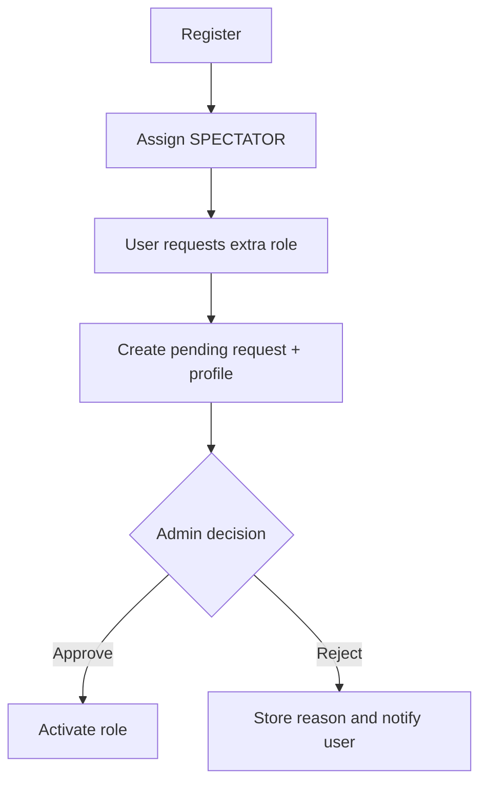
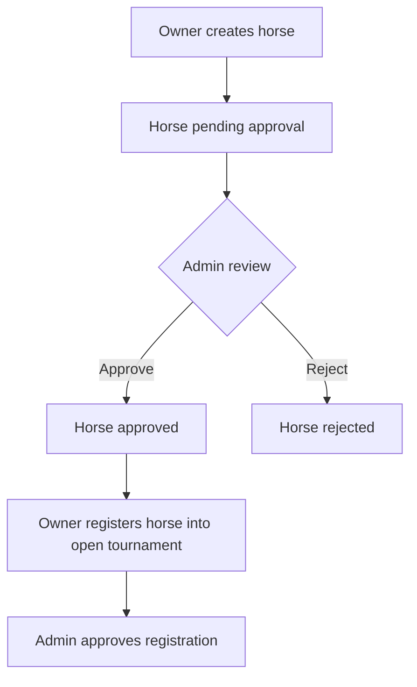
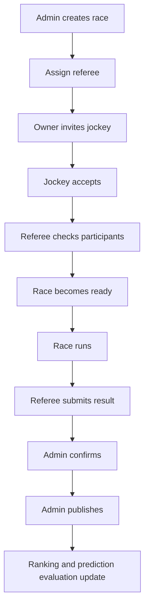
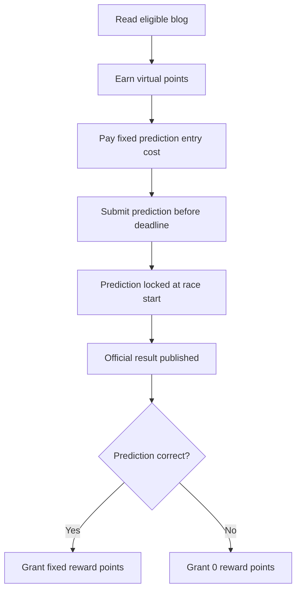
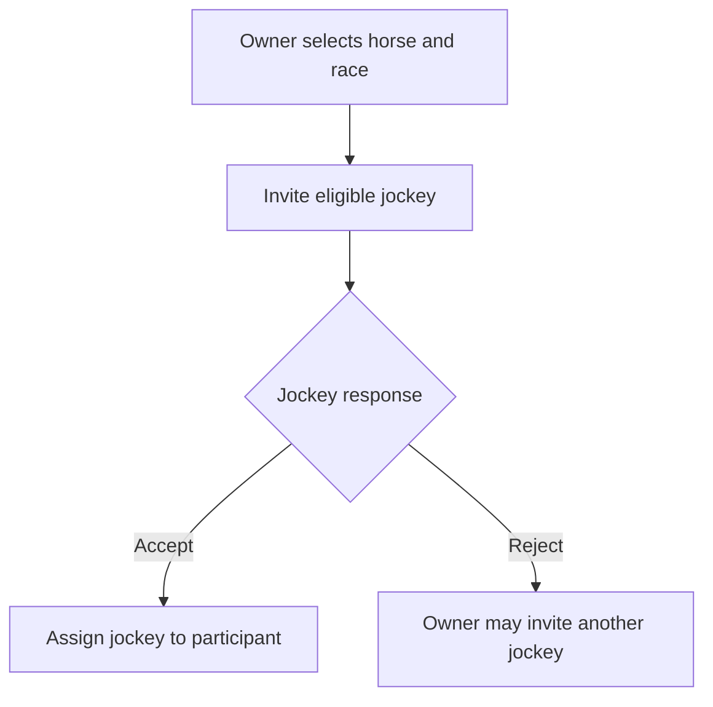

# Workflows

## 1. Registration and role request

```mermaid
flowchart TD
    A["Register"] --> B["Assign SPECTATOR"]
    B --> C["User requests extra role"]
    C --> D["Create pending request + profile"]
    D --> E{"Admin decision"}
    E -->|Approve| F["Activate role"]
    E -->|Reject| G["Store reason and notify user"]
```

## 2. Horse to tournament registration

```mermaid
flowchart TD
    A["Owner creates horse"] --> B["Horse pending approval"]
    B --> C{"Admin review"}
    C -->|Approve| D["Horse approved"]
    C -->|Reject| E["Horse rejected"]
    D --> F["Owner registers horse into open tournament"]
    F --> G["Admin approves registration"]
```

## 3. Race operation

```mermaid
flowchart TD
    A["Admin creates race"] --> B["Assign referee"]
    B --> C["Owner invites jockey"]
    C --> D["Jockey accepts"]
    D --> E["Referee checks participants"]
    E --> F["Race becomes ready"]
    F --> G["Race runs"]
    G --> H["Referee submits result"]
    H --> I["Admin confirms"]
    I --> J["Admin publishes"]
    J --> K["Ranking and prediction evaluation update"]
```

## 4. Prediction lifecycle

```mermaid
flowchart TD
    A["Read eligible blog"] --> B["Earn virtual points"]
    B --> C["Pay fixed prediction entry cost"]
    C --> D["Submit prediction before deadline"]
    D --> E["Prediction locked at race start"]
    E --> F["Official result published"]
    F --> G{"Prediction correct?"}
    G -->|Yes| H["Grant fixed reward points"]
    G -->|No| I["Grant 0 reward points"]
```

## 5. Jockey invitation

```mermaid
flowchart TD
    A["Owner selects horse and race"] --> B["Invite eligible jockey"]
    B --> C{"Jockey response"}
    C -->|Accept| D["Assign jockey to participant"]
    C -->|Reject| E["Owner may invite another jockey"]
```

