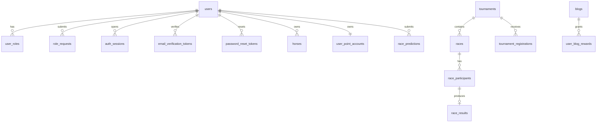
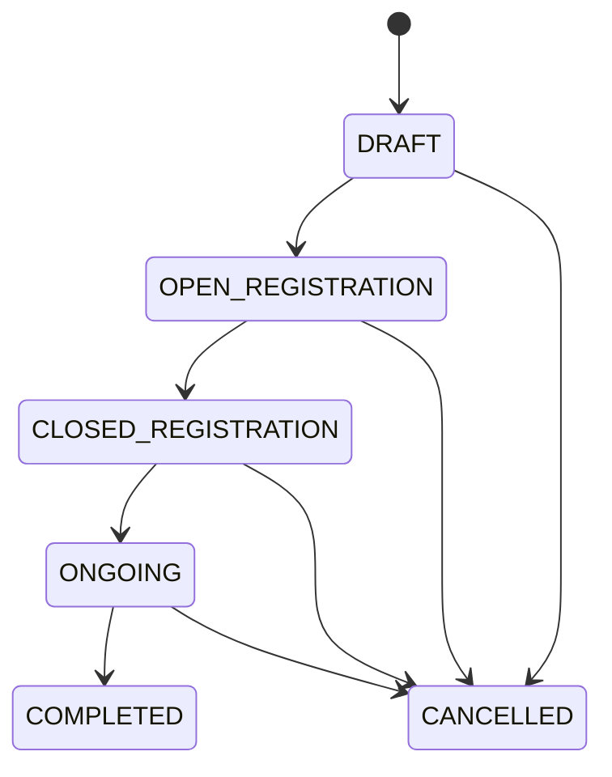
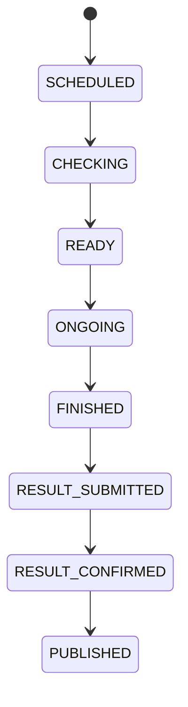
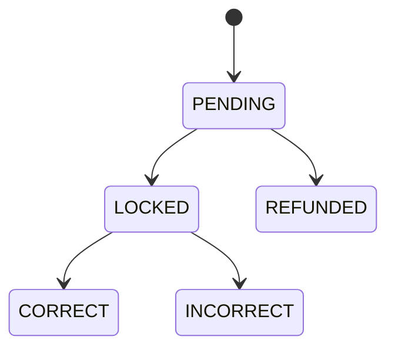
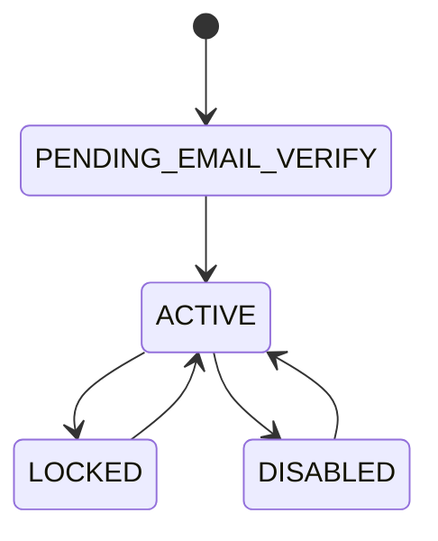

# ERD and Status Lifecycles

## 1. High-level ERD

```mermaid
erDiagram
    users ||--o{ user_roles : has
    users ||--o{ role_requests : submits
    users ||--o{ auth_sessions : opens
    users ||--o{ email_verification_tokens : verifies
    users ||--o{ password_reset_tokens : resets
    users ||--o{ horses : owns
    tournaments ||--o{ races : contains
    tournaments ||--o{ tournament_registrations : receives
    races ||--o{ race_participants : has
    race_participants ||--o| race_results : produces
    users ||--|| user_point_accounts : owns
    users ||--o{ race_predictions : submits
    blogs ||--o{ user_blog_rewards : grants
```

## 2. Tournament lifecycle

```mermaid
stateDiagram-v2
    [*] --> DRAFT
    DRAFT --> OPEN_REGISTRATION
    OPEN_REGISTRATION --> CLOSED_REGISTRATION
    CLOSED_REGISTRATION --> ONGOING
    ONGOING --> COMPLETED
    DRAFT --> CANCELLED
    OPEN_REGISTRATION --> CANCELLED
    CLOSED_REGISTRATION --> CANCELLED
    ONGOING --> CANCELLED
```

## 3. Race lifecycle

```mermaid
stateDiagram-v2
    [*] --> SCHEDULED
    SCHEDULED --> CHECKING
    CHECKING --> READY
    READY --> ONGOING
    ONGOING --> FINISHED
    FINISHED --> RESULT_SUBMITTED
    RESULT_SUBMITTED --> RESULT_CONFIRMED
    RESULT_CONFIRMED --> PUBLISHED
```

## 4. Prediction lifecycle

```mermaid
stateDiagram-v2
    [*] --> PENDING
    PENDING --> LOCKED
    LOCKED --> CORRECT
    LOCKED --> INCORRECT
    PENDING --> REFUNDED
```

## 5. User authentication lifecycle

```mermaid
stateDiagram-v2
    [*] --> PENDING_EMAIL_VERIFY
    PENDING_EMAIL_VERIFY --> ACTIVE
    ACTIVE --> LOCKED
    ACTIVE --> DISABLED
    LOCKED --> ACTIVE
    DISABLED --> ACTIVE
```
