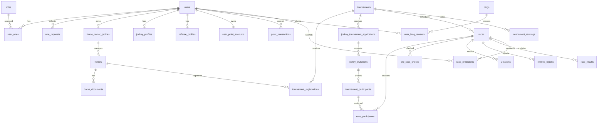

# ERD And Status Lifecycles

## 1. High-Level ERD



## 2. Main Status Lifecycles

### User account

`PENDING_EMAIL_VERIFY -> ACTIVE`

Admin/security states can also include `LOCKED` and `DISABLED`.

### Role request

```text
PENDING -> APPROVED
PENDING -> REJECTED
PENDING -> CANCELLED
```

CV review state: `NOT_REVIEWED -> PASSED`.

### Horse

```text
PENDING -> APPROVED
PENDING -> REJECTED
APPROVED -> INACTIVE
APPROVED -> SUSPENDED
```

### Owner tournament registration

```text
PENDING -> APPROVED
PENDING -> REJECTED
PENDING -> WITHDRAWN
```

### Jockey pool application

```text
PENDING -> APPROVED_FOR_POOL
PENDING -> REJECTED
PENDING -> WITHDRAWN
```

### Jockey contract/invitation

```text
PENDING -> ACCEPTED
PENDING -> REJECTED
PENDING -> EXPIRED
```

Legacy schema also includes `CANCELLED`.

### Race participant checks

- Confirmation: `PENDING`, `CONFIRMED`, `WITHDRAWN`.
- Pre-race check: `NOT_CHECKED`, `PASSED`, `FAILED`, `CONDITIONAL`.
- Participant status: `REGISTERED`, `APPROVED`, `DISQUALIFIED`, `WITHDRAWN`.

### Race result

Result workflow status:

```text
DRAFT -> SUBMITTED -> CONFIRMED -> PUBLISHED
SUBMITTED -> REJECTED
```

Result entry status:

- `FINISHED`
- `DISQUALIFIED`
- `DID_NOT_FINISH`
- `WITHDRAWN`

### Blog

Current backend enum:

```text
DRAFT -> PUBLISHED
```

Legacy database script may include `HIDDEN`.

### Prediction

```text
PENDING -> LOCKED -> CORRECT
PENDING -> LOCKED -> INCORRECT
PENDING -> CANCELLED
LOCKED -> REFUNDED
```

### Prediction settlement job

```text
PENDING -> PROCESSING -> COMPLETED
PENDING -> PROCESSING -> FAILED
FAILED -> PENDING
```

Retry moves a failed job back into a processable state.

## 3. Point Ledger Lifecycle

`user_point_accounts` stores the current balance. `point_transactions` stores each balance-changing event.

Transaction types:

- `FIRST_LOGIN_BONUS`
- `PREDICTION_ENTRY`
- `PREDICTION_REWARD`
- `BLOG_REWARD`
- `RACE_CANCEL_REFUND`
- `ADMIN_ADJUSTMENT`

Reference types:

- `RACE_PREDICTION`
- `RACE_RESULT`
- `BLOG`
- `ADMIN`
- `RACE`
