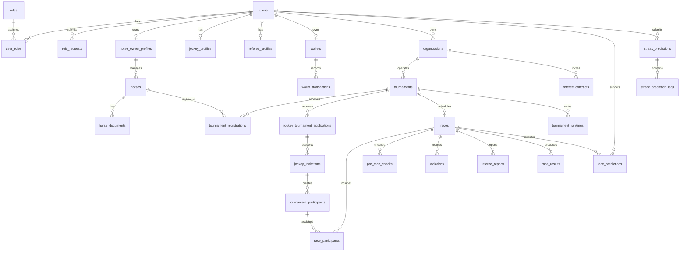

# ERD And Status Lifecycles

## 1. High-Level ERD



## 2. Main Status Lifecycles

### User account

`PENDING_EMAIL_VERIFY -> ACTIVE`

Schema also supports administrative states such as `SUSPENDED`, `INACTIVE`, and `BANNED` after organizer migrations.

### Role request

```text
PENDING -> APPROVED
PENDING -> REJECTED
PENDING -> CANCELLED
```

CV review state includes `NOT_REVIEWED` and `PASSED`.

### Organization

```text
PENDING -> ACTIVE
PENDING -> REJECTED
ACTIVE -> SUSPENDED
SUSPENDED -> ACTIVE
REJECTED -> PENDING
```

Rejected applications are reused for resubmission instead of duplicating organization rows.

### Tournament launch

Organizer-created tournaments are drafted and submitted for platform approval. Current code includes organizer submit and admin approve/reject endpoints; statuses are represented by the `TournamentStatus` enum and status transitions in tournament services.

### Horse

```text
PENDING -> APPROVED
PENDING -> REJECTED
APPROVED -> INACTIVE
APPROVED -> SUSPENDED
```

### Owner tournament registration

```text
PENDING -> APPROVED
PENDING -> REJECTED
PENDING -> WITHDRAWN
```

`PENDING` and `APPROVED` count as active owner participation for the one-role-per-tournament guard.

### Jockey pool application

```text
PENDING -> APPROVED_FOR_POOL
PENDING -> REJECTED
PENDING -> WITHDRAWN
```

`PENDING` and `APPROVED_FOR_POOL` count as active jockey participation for the one-role-per-tournament guard.

### Jockey contract/invitation

```text
PENDING -> ACCEPTED
PENDING -> REJECTED
PENDING -> EXPIRED
```

Legacy schema also includes `CANCELLED`.

### Referee contract

```text
PENDING -> ACTIVE
PENDING -> DECLINED
ACTIVE -> TERMINATED
```

`ACTIVE` counts as active referee participation for the one-role-per-tournament guard.

### Race participant checks

- Confirmation: `PENDING`, `CONFIRMED`, `WITHDRAWN`.
- Pre-race check: `NOT_CHECKED`, `PASSED`, `FAILED`, `CONDITIONAL`.
- Participant status: `REGISTERED`, `APPROVED`, `DISQUALIFIED`, `WITHDRAWN`.

### Race result

Result workflow status:

```text
DRAFT -> SUBMITTED -> CONFIRMED -> PUBLISHED
SUBMITTED -> REJECTED
CONFIRMED -> DRAFT
```

Result entry status:

- `FINISHED`
- `DISQUALIFIED`
- `DID_NOT_FINISH`
- `WITHDRAWN`

### Blog

Current backend enum:

```text
DRAFT -> PUBLISHED
```

### Wallet

Wallet status:

```text
ACTIVE -> LOCKED
LOCKED -> ACTIVE
```

Wallet transaction types:

- `TOPUP`
- `BET_PLACED`
- `BET_PAYOUT`
- `BET_REFUND`
- `WITHDRAWAL_HOLD`
- `WITHDRAWAL_REFUND`
- `ADMIN_ADJUSTMENT`

### Top-up

```text
PENDING -> SUCCESS
PENDING -> FAILED
PENDING -> EXPIRED
```

The enum also contains `INITIATED`; current order creation starts at `PENDING`.

### Withdrawal

```text
REQUESTED -> APPROVED -> PAID
REQUESTED -> REJECTED
REQUESTED -> CANCELLED
APPROVED -> REJECTED
```

Rejection/cancellation refunds the held wallet amount.

### Prediction

```text
PENDING -> LOCKED -> CORRECT
PENDING -> LOCKED -> INCORRECT
PENDING -> CANCELLED
PENDING -> REFUNDED
LOCKED -> REFUNDED
```

### Streak prediction

```text
PENDING -> IN_PROGRESS -> WON
PENDING -> IN_PROGRESS -> LOST
PENDING -> REFUNDED
IN_PROGRESS -> REFUNDED
```

### Prediction settlement job

```text
PENDING -> PROCESSING -> COMPLETED
PENDING -> PROCESSING -> FAILED
FAILED -> PENDING
```

Retry moves a failed job back into a processable state.
