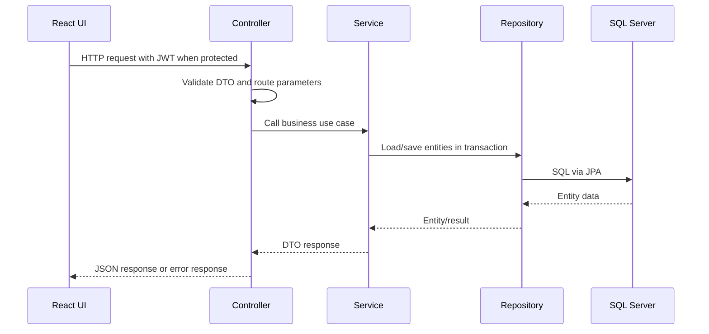

# Backend Architecture

## 1. Package Strategy

The backend uses a domain-first package structure under:

`com.example.horseracingtournamentsystem`

```text
auth/
blog/
championship/
common/
config/
filestorage/
horse/
point/
prediction/
race/
referee/
result/
security/
tournament/
tournamentregistration/
user/
aiinsight/
notification/
```

Most active domains keep the same internal shape:

```text
controller -> service -> repository -> entity
dto/request and dto/response at module boundary
```

## 2. Request Flow



## 3. Main Modules

- `auth`: registration, verification email, login, refresh, logout, token/session services.
- `security`: JWT service/filter, user details, CORS, rate limiting, REST auth error handlers, production cookie validator.
- `user`: profile APIs, role request workflow, admin user management, owner/referee profile APIs.
- `horse`: owner horse management, admin horse review, public/admin horse APIs, horse document upload.
- `tournament`: public tournament list/detail and admin tournament management.
- `tournamentregistration`: owner registration workflow and admin registration review.
- `championship`: jockey pool application, owner contract, jockey contract response, admin participant lock/workspace.
- `race`: public/admin race APIs and jockey schedule.
- `referee`: assigned race operations, pre-checks, result package, incidents, violations, reports.
- `result`: race result persistence.
- `prediction`: spectator prediction APIs, admin audit APIs, settlement scheduler.
- `blog`: public blog APIs, admin blog management, blog reward service.
- `point`: point settings, point account, point transaction logic.
- `filestorage`: generic file upload/download and private file access.
- `common`: global exception handling and upload support.

## 4. Transaction And Validation Rules

- Controllers expose DTOs, not JPA entities.
- Services own business validation and transactional workflows.
- Repositories encapsulate persistence queries only.
- Cross-table workflows such as role approval, blog reward claim, point spending, prediction settlement, and referee result submission should remain service-level operations.
- Global exception handling converts validation/auth/business failures into stable JSON responses.

## 5. Security Architecture

- Access tokens are validated by `JwtAuthenticationFilter`.
- User identity loads through `CustomUserDetailsService`.
- Refresh sessions are persisted through auth session repositories and refreshed through `/api/v1/auth/refresh`.
- Role access is enforced by backend security and frontend route guards.
- Rate limiting is configurable for login, upload, and prediction submit flows.
- Production profile requires stricter refresh cookie settings.
