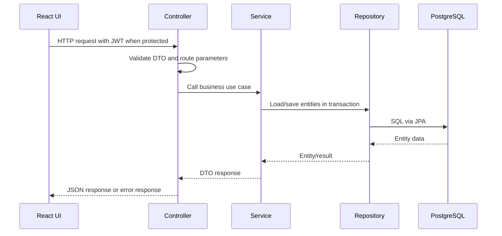

# Backend Architecture

> This document is the architectural summary. The file-level walkthrough — every package,
> service, scheduler, migration and test convention — is in
> [`../../reference/backend-source-guide.md`](../../reference/backend-source-guide.md).

## 1. Package Strategy

The backend uses a domain-first package structure under:

`com.example.horseracingtournamentsystem`

```text
auth/
blog/
championship/
common/
config/
dashboard/
dispute/
filestorage/
finance/
horse/
leaderboard/
notification/
organization/
prediction/
race/            (includes the self-contained race/media sub-module)
referee/
result/
security/
tournament/
tournamentregistration/
user/
wallet/
```

`aiinsight/`, `common/config/`, `common/exception/` and `common/response/` exist on disk but
contain only `.gitkeep`. They are reserved package slots, not implemented features.

Most active domains keep the same internal shape:

```text
controller -> service -> repository -> entity
dto/request and dto/response at module boundary
```

## 2. Request Flow



## 3. Main Modules

- `auth`: registration, verification email, login, refresh, logout, token/session services.
- `security`: JWT service/filter, user details, CORS, rate limiting, REST auth error handlers, production cookie validator.
- `user`: profile APIs, role request workflow, admin user management, owner/referee profile APIs, role policy.
- `organization`: organization registration, admin KYB review, organizer business-role separation.
- `horse`: owner horse management, admin horse review, public/admin horse APIs, horse document upload.
- `tournament`: public tournament list/detail, admin tournament management, organizer tournament management, participation guard.
- `tournamentregistration`: owner registration workflow and registration review.
- `championship`: jockey pool application, owner-jockey contracts, referee contracts, participant lock/workspace.
- `race`: public/admin/organizer race APIs, result publish/reopen/confirm, jockey schedule.
- `race/media`: YouTube highlights and live streams, provider-verified before publishing.
- `referee`: assigned race operations, pre-checks, result package, incidents, violations, reports.
- `result`: race result persistence.
- `prediction`: spectator prediction APIs, quotes, streak predictions, admin audit APIs, settlement scheduler.
- `wallet`: wallet account, transaction ledger, VNPay top-up, withdrawals, saved bank accounts.
- `finance`: admin-only reporting over the wallet ledger, reconciliation and orphan-credit detection.
- `dispute`: spectator disputes and account appeals for suspended/banned users.
- `blog`: public blog APIs and admin blog management.
- `leaderboard`: public leaderboard.
- `dashboard`: aggregated admin overview.
- `notification`: persisted user notifications.
- `filestorage`: generic file upload/download and private file access.
- `common`: global exception handling and upload support.

## 4. Transaction And Validation Rules

- Controllers expose DTOs, not JPA entities.
- Services own business validation and transactional workflows.
- Repositories encapsulate persistence queries only.
- Cross-table workflows such as role approval, organization approval, tournament participation guard checks, wallet adjustment, prediction settlement, withdrawal review, and referee result submission remain service-level operations.
- Global exception handling converts validation/auth/business failures into stable JSON responses.

## 5. Security Architecture

- Access tokens are validated by `JwtAuthenticationFilter`.
- User identity loads through `CustomUserDetailsService`.
- Refresh sessions are persisted through auth session repositories and refreshed through `/api/v1/auth/refresh`.
- Role access is enforced by backend security and frontend route guards.
- Current role route guards include admin, organizer, owner, jockey, referee, and authenticated-user routes.
- Rate limiting is configurable for login, upload, prediction submit, forgot-password, and reset-password flows.
- Production profile requires stricter refresh cookie settings.
