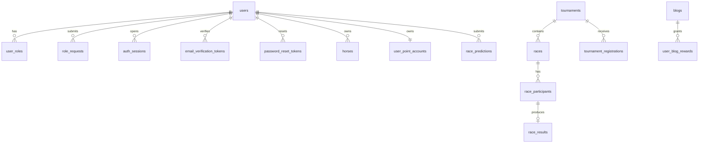
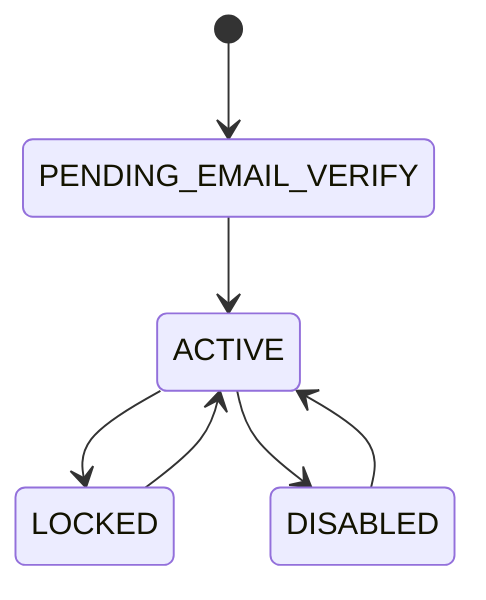

# Database End-to-End Implementation Plan

> **For agentic workers:** REQUIRED SUB-SKILL: Use superpowers:subagent-driven-development (recommended) or superpowers:executing-plans to implement this plan task-by-task. Steps use checkbox (`- [ ]`) syntax for tracking.

**Goal:** Turn the database into a coherent migration chain with production-safe bootstrap data, complete auth support, stronger integrity constraints, separated dev/test seed data, and synchronized data documentation.

**Architecture:** Keep `001_create_tables.sql` as the full fresh-install schema, with seed data split into separate bootstrap and dev scripts. Document which business rules are enforced by SQL versus by the application layer.

**Tech Stack:** SQL Server, T-SQL, Markdown documentation.

---

## File Structure

### Create

- `database/002_bootstrap_seed.sql`
- `database/003_auth.sql`
- `database/004_integrity_refinements.sql`
- `database/900_dev_seed.sql`

### Modify

- `database/001_create_tables.sql`
- `database/002_seed_data.sql` → remove after splitting into bootstrap/dev seeds
- `docs/specs/data/01_database-design.md`
- `docs/specs/data/02_erd-and-status-lifecycles.md`

---

### Task 1: Prepare the migration baseline

**Files:**
- Modify: `database/001_create_tables.sql`

- [ ] **Step 1: Change new-user default state**

Replace:

```sql
status VARCHAR(30) NOT NULL DEFAULT 'ACTIVE'
```

with:

```sql
status VARCHAR(30) NOT NULL DEFAULT 'PENDING_EMAIL_VERIFY'
```

- [ ] **Step 2: Remove inline role seed from the base schema**

Delete the `INSERT INTO roles ...` block near the end of `001_create_tables.sql`.

- [ ] **Step 3: Update the section heading**

Replace:

```sql
-- 8. OPTIONAL SEED DATA
```

with:

```sql
-- 8. BUSINESS RULE NOTES
```

and renumber the following heading from `9` to `8`.

- [ ] **Step 4: Verify no role inserts remain in the base schema**

Run:

```powershell
Select-String -Path 'database/001_create_tables.sql' -Pattern 'INSERT INTO roles'
```

Expected: no matches.

- [ ] **Step 5: Commit**

```bash
git add database/001_create_tables.sql
git commit -m "refactor: separate base schema from bootstrap seed"
```

### Task 2: Create production-safe bootstrap seed

**Files:**
- Create: `database/002_bootstrap_seed.sql`

- [ ] **Step 1: Write the bootstrap seed**

Create:

```sql
-- =====================================================================
-- Horse Racing Tournament Management System
-- Bootstrap Seed Script
-- Purpose:
--   - Required system roles
--   - Default administrator account for first-run access
-- =====================================================================

INSERT INTO roles (name, description)
VALUES
    ('ADMIN', 'System administrator'),
    ('HORSE_OWNER', 'Horse owner'),
    ('JOCKEY', 'Jockey'),
    ('REFEREE', 'Race referee'),
    ('SPECTATOR', 'Spectator and race prediction user');

-- Password: Admin@123
-- BCrypt hash of Admin@123.
-- This is a bootstrap credential only and must be changed after first login in real deployments.
INSERT INTO users (full_name, email, password_hash, status, email_verified, created_at)
VALUES (
    'System Administrator',
    'admin@horse-racing.local',
    '$2a$10$dXJ3SW6G7P50lGmMkkmwe.20cQQubK3.HZWzG3YB1tlRy.fqvM/BG',
    'ACTIVE',
    1,
    SYSDATETIME()
);

INSERT INTO user_roles (user_id, role_id, status, assigned_at)
SELECT u.id, r.id, 'ACTIVE', SYSDATETIME()
FROM users u
CROSS JOIN roles r
WHERE u.email = 'admin@horse-racing.local'
  AND r.name IN ('ADMIN', 'SPECTATOR');
```

- [ ] **Step 2: Verify the script contains only bootstrap data**

Run:

```powershell
Select-String -Path 'database/002_bootstrap_seed.sql' -Pattern 'owner@demo.local','HORSE-001'
```

Expected: no matches.

- [ ] **Step 3: Commit**

```bash
git add database/002_bootstrap_seed.sql
git commit -m "feat: add bootstrap seed data"
```

### Task 3: Add auth schema migration

**Files:**
- Create: `database/003_auth.sql`

- [ ] **Step 1: Create the auth migration**

Use:

```sql
ALTER TABLE users
ADD password_changed_at DATETIME2 NULL;

CREATE TABLE auth_sessions (
    id BIGINT NOT NULL IDENTITY(1,1),
    user_id BIGINT NOT NULL,
    refresh_token_hash VARCHAR(255) NOT NULL,
    user_agent NVARCHAR(500) NULL,
    ip_address VARCHAR(100) NULL,
    expires_at DATETIME2 NOT NULL,
    revoked_at DATETIME2 NULL,
    replaced_by_session_id BIGINT NULL,
    created_at DATETIME2 NOT NULL DEFAULT SYSDATETIME(),
    last_used_at DATETIME2 NULL,
    CONSTRAINT pk_auth_sessions PRIMARY KEY (id),
    CONSTRAINT fk_auth_sessions_user FOREIGN KEY (user_id) REFERENCES users(id),
    CONSTRAINT fk_auth_sessions_replaced_by FOREIGN KEY (replaced_by_session_id) REFERENCES auth_sessions(id)
);

CREATE INDEX idx_auth_sessions_user_id ON auth_sessions(user_id);
CREATE INDEX idx_auth_sessions_expires_at ON auth_sessions(expires_at);

CREATE TABLE email_verification_tokens (
    id BIGINT NOT NULL IDENTITY(1,1),
    user_id BIGINT NOT NULL,
    token_hash VARCHAR(255) NOT NULL,
    expires_at DATETIME2 NOT NULL,
    used_at DATETIME2 NULL,
    created_at DATETIME2 NOT NULL DEFAULT SYSDATETIME(),
    CONSTRAINT pk_email_verification_tokens PRIMARY KEY (id),
    CONSTRAINT fk_evt_user FOREIGN KEY (user_id) REFERENCES users(id)
);

CREATE INDEX idx_evt_user_id ON email_verification_tokens(user_id);
CREATE INDEX idx_evt_expires_at ON email_verification_tokens(expires_at);

CREATE TABLE password_reset_tokens (
    id BIGINT NOT NULL IDENTITY(1,1),
    user_id BIGINT NOT NULL,
    token_hash VARCHAR(255) NOT NULL,
    expires_at DATETIME2 NOT NULL,
    used_at DATETIME2 NULL,
    created_at DATETIME2 NOT NULL DEFAULT SYSDATETIME(),
    CONSTRAINT pk_password_reset_tokens PRIMARY KEY (id),
    CONSTRAINT fk_prt_user FOREIGN KEY (user_id) REFERENCES users(id)
);

CREATE INDEX idx_prt_user_id ON password_reset_tokens(user_id);
CREATE INDEX idx_prt_expires_at ON password_reset_tokens(expires_at);
```

- [ ] **Step 2: Verify the expected auth tables are present**

Run:

```powershell
Select-String -Path 'database/003_auth.sql' -Pattern 'auth_sessions','email_verification_tokens','password_reset_tokens','password_changed_at'
```

Expected: all four patterns appear.

- [ ] **Step 3: Commit**

```bash
git add database/003_auth.sql
git commit -m "feat: add auth database schema"
```

### Task 4: Add integrity refinements

**Files:**
- Create: `database/004_integrity_refinements.sql`

- [ ] **Step 1: Create role-request and invitation uniqueness rules**

Use:

```sql
CREATE UNIQUE INDEX uq_role_requests_pending
ON role_requests(user_id, requested_role)
WHERE status = 'PENDING';

CREATE UNIQUE INDEX uq_jockey_invitations_pending
ON jockey_invitations(race_id, horse_id)
WHERE status = 'PENDING';
```

- [ ] **Step 2: Create prediction distinctness rule**

Append:

```sql
ALTER TABLE race_predictions
ADD CONSTRAINT chk_rpred_top3_distinct CHECK (
    prediction_type <> 'TOP3'
    OR (
        predicted_second_id IS NOT NULL
        AND predicted_third_id IS NOT NULL
        AND predicted_winner_id <> predicted_second_id
        AND predicted_winner_id <> predicted_third_id
        AND predicted_second_id <> predicted_third_id
    )
);
```

- [ ] **Step 3: Add role-history status validation**

Append:

```sql
ALTER TABLE user_role_history
ADD CONSTRAINT chk_urh_old_status CHECK (
    old_status IS NULL OR old_status IN ('ACTIVE', 'SUSPENDED', 'REMOVED')
);

ALTER TABLE user_role_history
ADD CONSTRAINT chk_urh_new_status CHECK (
    new_status IN ('ACTIVE', 'SUSPENDED', 'REMOVED')
);
```

- [ ] **Step 4: Verify all intended refinements exist**

Run:

```powershell
Select-String -Path 'database/004_integrity_refinements.sql' -Pattern 'uq_role_requests_pending','uq_jockey_invitations_pending','chk_rpred_top3_distinct','chk_urh_old_status','chk_urh_new_status'
```

Expected: all five patterns appear.

- [ ] **Step 5: Commit**

```bash
git add database/004_integrity_refinements.sql
git commit -m "feat: add database integrity refinements"
```

### Task 5: Split demo seed from bootstrap data

**Files:**
- Create: `database/900_dev_seed.sql`
- Delete: `database/002_seed_data.sql`

- [ ] **Step 1: Create `900_dev_seed.sql`**

Move all non-bootstrap records from the old seed file into `900_dev_seed.sql`:

- demo users,
- their `SPECTATOR` roles,
- additional approved roles,
- owner/jockey/referee profiles,
- demo horses.

Do **not** include:

- role inserts,
- default admin insert,
- admin role assignments.

- [ ] **Step 2: Delete the old mixed seed file**

Remove:

```text
database/002_seed_data.sql
```

- [ ] **Step 3: Verify the new file is dev-only**

Run:

```powershell
Select-String -Path 'database/900_dev_seed.sql' -Pattern 'admin@horse-racing.local','INSERT INTO roles'
```

Expected: no matches.

- [ ] **Step 4: Commit**

```bash
git add database/900_dev_seed.sql
git rm database/002_seed_data.sql
git commit -m "refactor: split bootstrap and dev seed data"
```

### Task 6: Update database design documentation

**Files:**
- Modify: `docs/specs/data/01_database-design.md`

- [ ] **Step 1: Replace the document with updated content**

Use:

```markdown
# Database Design

## 1. Current source of truth

The database is defined by an ordered migration chain:

1. `database/001_create_tables.sql`
2. `database/002_bootstrap_seed.sql`
3. `database/003_auth.sql`
4. `database/004_integrity_refinements.sql`

Optional local/demo data lives in:

- `database/900_dev_seed.sql`

## 2. Main table groups

- identity and authorization,
- auth sessions and one-time tokens,
- profiles,
- horse and tournament,
- race operations,
- result and ranking,
- engagement and notifications,
- blog rewards.

## 3. Bootstrap vs dev seed

- bootstrap seed contains required roles and the default admin account,
- dev seed contains demo users, approved sample roles, profiles, and horses,
- production environments should not depend on dev seed data.

## 4. Virtual point model

The clean model uses:

- `user_point_accounts`,
- `point_transactions`,
- `race_predictions`,
- blog reward tables.

## 5. Prediction schema

The prediction model uses:

- `entry_cost_points`,
- `reward_points`,
- fixed reward rules,
- refund only when a race is cancelled.

The schema intentionally excludes:

- prediction pools,
- reward multipliers,
- system-retention calculations,
- user-to-user redistribution semantics.

## 6. Database-enforced invariants

- unique ownership and registration constraints,
- one pending role request per user and requested role,
- one pending jockey invitation per race and horse,
- distinct `TOP3` prediction picks,
- explicit lifecycle constraints,
- one-time blog reward claims,
- append-only point transaction history.

## 7. Application-enforced rules

- only open tournaments accept registrations,
- only the assigned referee submits results,
- predictions close before their deadline,
- rankings update only after official publication,
- anti-farming thresholds for blog rewards are checked by the backend.
```

- [ ] **Step 2: Verify migration names appear**

Run:

```powershell
Select-String -Path 'docs/specs/data/01_database-design.md' -Pattern '002_bootstrap_seed.sql','003_auth.sql','004_integrity_refinements.sql','900_dev_seed.sql'
```

Expected: all four migration names appear.

- [ ] **Step 3: Commit**

```bash
git add docs/specs/data/01_database-design.md
git commit -m "docs: update database design source of truth"
```

### Task 7: Update ERD and lifecycle documentation

**Files:**
- Modify: `docs/specs/data/02_erd-and-status-lifecycles.md`

- [ ] **Step 1: Update ERD**

Replace the ERD with:

```markdown

```

- [ ] **Step 2: Add auth lifecycle section**

Append:

```markdown
## 5. User authentication lifecycle


```

- [ ] **Step 3: Verify auth entities appear**

Run:

```powershell
Select-String -Path 'docs/specs/data/02_erd-and-status-lifecycles.md' -Pattern 'auth_sessions','email_verification_tokens','password_reset_tokens','User authentication lifecycle'
```

Expected: all four patterns appear.

- [ ] **Step 4: Commit**

```bash
git add docs/specs/data/02_erd-and-status-lifecycles.md
git commit -m "docs: extend erd with auth schema"
```

### Task 8: Final verification pass

**Files:**
- No file changes expected

- [ ] **Step 1: Verify database files**

Run:

```powershell
Get-ChildItem database | Select-Object -ExpandProperty Name
```

Expected:

```text
001_create_tables.sql
002_bootstrap_seed.sql
003_auth.sql
004_integrity_refinements.sql
900_dev_seed.sql
```

- [ ] **Step 2: Verify no stale mixed seed file remains**

Run:

```powershell
Test-Path 'database/002_seed_data.sql'
```

Expected: `False`.

- [ ] **Step 3: Review auth completeness**

Run:

```powershell
Select-String -Path 'database/*.sql' -Pattern 'auth_sessions','email_verification_tokens','password_reset_tokens','password_changed_at'
```

Expected: all required auth structures are present.

- [ ] **Step 4: Review integrity completeness**

Run:

```powershell
Select-String -Path 'database/*.sql' -Pattern 'uq_role_requests_pending','uq_jockey_invitations_pending','chk_rpred_top3_distinct'
```

Expected: all required integrity objects are present.

## Self-Review

### Spec coverage

- migration strategy: Tasks 1-5
- bootstrap admin: Task 2
- auth schema completion: Task 3
- SQL-enforced integrity: Task 4
- dev/test seed separation: Task 5
- docs synchronization: Tasks 6-7
- verification: Task 8

### Placeholder scan

- No placeholders remain.

### Type consistency

- Migration names, table names, and constraint names match the design spec exactly.
