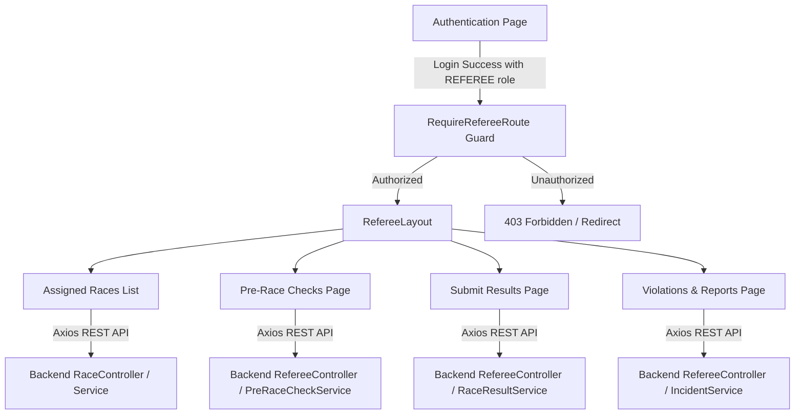

# Referee Dashboard System Design Specification

This document details the architectural design and functional specifications for the Referee Dashboard inside the Horse Racing Tournament Management System. The Referee Dashboard is a premium, minimalist workspace dedicated to official race operations, including participant verification, results submission, rules violation reporting, and officiating report creation.

---

## 1. Architectural Overview

The referee subsystem resides within both the React-based frontend and Spring Boot backend. It isolates referee-specific officiating duties into a high-security nested layout structure, preventing unauthorized roles from accessing sensitive operational data.

---

## 2. Frontend Specifications

### 2.1 Router and Guards
- **Route Guard (`RequireRefereeRoute.tsx`)**: Reusable wrapper that decodes the user token, checks for the presence of the `REFEREE` role, and permits child rendering or navigates to `/` (home) / `403` if unauthorized.
- **Nested Routing Structure (`AppRouter.tsx`)**:
  - `/referee` (renders the `RefereeLayout` and defaults to the Assigned Races page)
  - `/referee/races/:id/check` (Pre-Race Checks page)
  - `/referee/races/:id/results` (Submit Results page)
  - `/referee/races/:id/report` (Violations & Reports page)

### 2.2 Layout (`RefereeLayout.tsx`)
- **Minimalist Light Theme**: Sleek white backgrounds (`#ffffff`), very light gray borders (`#e2e8f0`), compact sans-serif typography (`-apple-system, BlinkMacSystemFont, "Segoe UI", Roboto, sans-serif`), and clean, light font weights.
- **Layout Panels**:
  - **Left Sidebar**: Unified navigation tree featuring current workspace details (`🛡️ Head Referee`) and navigation links.
  - **Top Navigation bar**: Displays logo, current logged-in user name (`Julian Sterling`), status badge (`Active`), and an explicit "Exit Dashboard" link returning to `/`.
  - **Content Canvas**: Responsive container with smooth micro-animations on route transitions.

### 2.3 Key Interface Components

#### A. Assigned Races View (`/referee`)
- Lists all active and scheduled races where `referee_id` equals the current user's ID.
- Displays race name, date, track condition, distance, registered participants, and operational status (`SCHEDULED`, `CHECKING`, `READY`, `ONGOING`).
- Action buttons: "Verify Pre-check" and "Submit Results".

#### B. Pre-Race Checks View (`/referee/races/:id/check`)
- Table-based participant verification sheet for all registered horses and jockeys.
- Inputs: checkboxes for jockey identity, horse identity, equipment/gear status, health status, and nài weight input field.
- Interactive status dropdown: `PASSED`, `FAILED`, `PENDING` for each participant entry.
- Action button: "Save Pre-Checks" triggers backend update.

#### C. Submit Results View (`/referee/races/:id/results`)
- Structured entry screen to log race positions and finish times.
- Inputs: numeric Rank field and decimal finish time (seconds with millisecond precision).
- Validation: checks for duplicate positions and negative finish times before submission.
- Action button: "Submit Official Results" (stores results as `SUBMITTED` for Admin review).

#### D. Incident Reports View (`/referee/races/:id/report`)
- Two-column grid layout:
  - **Infraction Log**: Select box for the offending jockey/horse, dropdown for infraction severity (`LOW`, `MEDIUM`, `HIGH`), and textarea for description.
  - **Referee Report**: Text input for title and textarea for a comprehensive officiating summary of the race.

---

## 3. Database Schema Mapping

The Referee Dashboard maps directly to existing tables in `001_create_tables.sql`:

1. **`races`**:
   - `referee_id` links the race to a specific referee user.
   - `status` tracks operational states (`SCHEDULED`, `CHECKING`, `READY`, `ONGOING`, `FINISHED`, `RESULT_SUBMITTED`).
2. **`pre_race_checks`**:
   - Stores individual horse and jockey verification checks.
3. **`violations`**:
   - Stores logged infractions reported by the referee during the race.
4. **`referee_reports`**:
   - Stores the text-based summary of race officiating.
5. **`race_results`**:
   - Stores finishing ranks, finish times, and points earned. Submitted by the referee, pending admin verification.

---

## 4. Backend Endpoints (Spring Boot)

We will introduce a dedicated `RefereeController` on the backend under `com.example.horseracingtournamentsystem.referee` using standard security annotations (`@PreAuthorize("hasRole('REFEREE')")`):

1. **`GET /api/referee/races`**
   - Returns a list of races assigned to the authenticated referee.
2. **`GET /api/referee/races/{raceId}/participants`**
   - Fetches all participants registered for race `raceId` to display in verification pages.
3. **`POST /api/referee/races/{raceId}/pre-checks`**
   - Saves/updates the verification checklist (`pre_race_checks` table) for all participants in the race.
4. **`POST /api/referee/races/{raceId}/results`**
   - Submits the finishing ranks and times. Triggers an update to race status to `RESULT_SUBMITTED`.
5. **`POST /api/referee/races/{raceId}/violations`**
   - Logs rules violations/infractions during the race.
6. **`POST /api/referee/races/{raceId}/reports`**
   - Submits the final officiating referee report.

---

## 5. Verification Plan

### Automated Tests
- **Frontend Route Guard Tests**: Assert that users without the `REFEREE` role are blocked from accessing `/referee` and redirected to `/`.
- **Pre-Check Submission Tests**: Mock api requests and verify that state changes are correctly rendered on the UI.
- **Duplicate Rank Verification**: Assert that submitting two horses with the same rank triggers a frontend validation error.
- **Backend Role Permission Tests**: Verify that requests to `/api/referee/*` endpoints return `403 Forbidden` if accessed without a `REFEREE` role token.

### Manual Verification
1. Log in with a standard Spectator account and manually navigate to `/referee` -> verify page blocks access.
2. Log in with a designated Referee account -> verify automatic redirection to `/referee`.
3. Interact with the Sidebar tabs -> verify correct nested routing.
4. Fill and submit the Pre-Race Checks form -> verify database records update in the `pre_race_checks` table.
5. Fill and submit the Final Results form -> verify race status transitions to `RESULT_SUBMITTED` and the admin panel receives a confirmation request.
