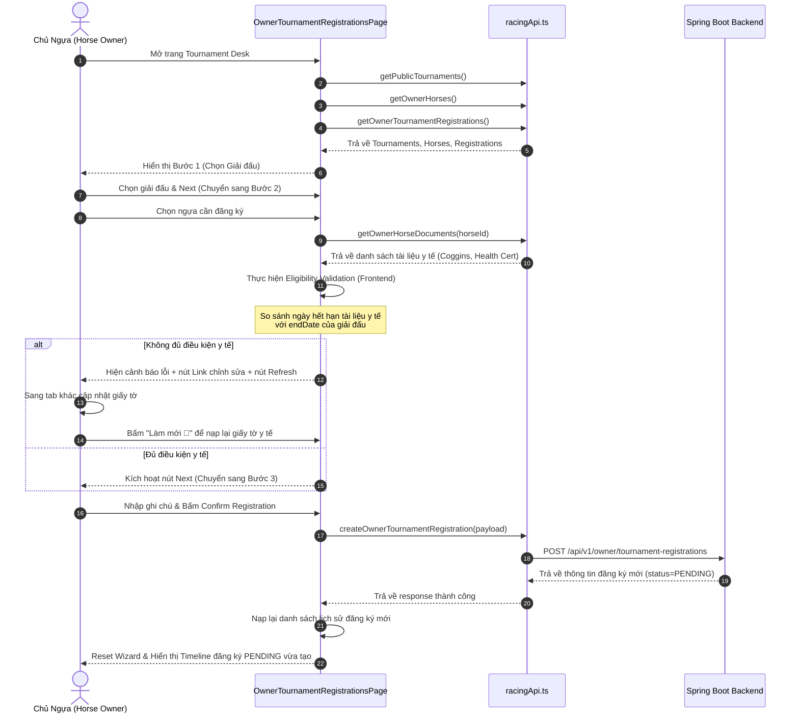

# Đặc tả Thiết kế: Luồng Đăng ký Giải đấu Nhiều Bước cho Horse Owner
**Ngày tạo:** 2026-05-28  
**Tác giả:** Antigravity AI  
**Dự án:** Hệ thống Quản lý Giải đấu Đua ngựa (Horse Racing Tournament Management System)  
**Trạng thái:** Đã được phê duyệt bởi Người dùng  

---

## 1. Tổng quan (Overview)
Tài liệu này đặc tả thiết kế cho tính năng **Đăng ký Giải đấu Nhiều bước (Multi-step Wizard Tournament Registration)** dành riêng cho vai trò **Chủ ngựa (Horse Owner)**. 

Thay vì sử dụng một biểu mẫu dòng đơn thô sơ, tính năng này được thiết kế theo các tiêu chuẩn UI/UX chuyên nghiệp, hiện đại và tinh tế (professional, modern, and polished UI/UX) nhằm mang lại trải nghiệm mượt mà và trực quan như ứng dụng thực tế. Nó tích hợp khả năng tự động kiểm tra tính hợp lệ của ngựa và các giấy tờ y tế bắt buộc ở phía Frontend nhằm nâng cao trải nghiệm người dùng (UX) trước khi gửi đơn đăng ký lên Backend Spring Boot - nơi đóng vai trò là nguồn xác thực cuối cùng (Source of Truth).

---

## 2. Phạm vi & Giới hạn thiết kế (Scope & Constraints)
Để đảm bảo luồng phát triển tinh gọn (MVP) và đúng trọng tâm, chúng ta phân tách rõ ràng vai trò của giải đấu lớn và các cuộc đua nhỏ:
1. **Tournament Registration (Hiện tại):** Chủ ngựa chỉ đăng ký ngựa tham gia vào toàn bộ Giải đấu lớn (Tournament) có trạng thái `OPEN_REGISTRATION`. Việc đăng ký chỉ yêu cầu chứng thực giấy tờ y tế hợp lệ cho ngựa.
2. **Race Setup & Participation (Tương lai):** Ban tổ chức (Admin/Staff) sẽ chịu trách nhiệm xếp ngựa đã được duyệt đăng ký vào các cuộc đua nhỏ cụ thể (Races) trong giải đấu.
3. **Jockey Invitation (Tương lai):** Chủ ngựa sẽ mời Nài ngựa (Jockey) tham gia vào từng trận đua cụ thể sau khi Admin đã sắp xếp lịch đua và ngựa tham gia.

### 2.1. Backend là Nguồn Xác Thực Cuối Cùng (Backend as Definitive Source of Truth)
Tất cả các kiểm tra điều kiện (Eligibility Checks) hiển thị ở phía Frontend đều mang tính chất hỗ trợ trải nghiệm người dùng (Advisory UX Checks). Backend Spring Boot (`TournamentRegistrationService`) là nơi bắt buộc phải tái thẩm định các thông tin sau trước khi ghi nhận đơn đăng ký vào cơ sở dữ liệu để ngăn chặn các truy cập vòng ngoài (bypass qua API Clients):
* Xác thực quyền sở hữu ngựa (Horse Ownership).
* Xác thực trạng thái của ngựa đã được duyệt chưa (Horse Approval Status).
* Xác thực tính hợp lệ của giấy tờ y tế còn hạn đến ngày kết thúc giải đấu (Document Validity).
* Xác thực chống đăng ký trùng lặp (Duplicate Registration).
* Xác thực trạng thái giải đấu đang mở và nằm trong khung thời gian đăng ký (Tournament Status & Window).
* Xác thực dung lượng giới hạn ngựa của giải đấu (Tournament Capacity Limit).

### 2.2. Xác Nhận API Hiện Có (Confirmed API Integration)
Hệ thống sẽ tái sử dụng API hiện có của Backend mà không cần phát triển thêm API mới:
* **API lấy danh sách tài liệu y tế:** `GET /api/v1/owner/horses/{horseId}/documents` (Hàm `getOwnerHorseDocuments(horseId)` trong `racingApi.ts`).
  * Trả về danh sách tài liệu chứa `documentType` (`COGGINS`, `HEALTH_CERTIFICATE`), `expiryDate`, và `fileUrl` để Frontend đối chiếu trực tiếp.

---

## 3. Kiến trúc Cấu trúc Thư mục (Code Structure)
Chúng ta sẽ triển khai theo mô hình Modular để giữ cho mã nguồn sạch sẽ, tách biệt trách nhiệm rõ ràng:

```text
frontend/src/pages/owner/
├── OwnerTournamentRegistrationsPage.tsx        # Wizard Controller (Trang chính điều phối)
└── components/
    ├── RegistrationWizardHeader.tsx            # Stepper tiến trình đăng ký (1 -> 2 -> 3)
    ├── StepSelectTournament.tsx                # Bước 1: Chọn giải đấu (OPEN_REGISTRATION)
    ├── StepSelectHorse.tsx                     # Bước 2: Chọn ngựa & Kiểm tra giấy tờ y tế
    ├── StepConfirmRegistration.tsx             # Bước 3: Nhập ghi chú & Gửi đăng ký
    └── RegistrationStatusTimeline.tsx          # Theo dõi Timeline trạng thái (sau khi đăng ký)
```

---

## 4. Chi tiết các Bước trong Luồng Wizard (Wizard Steps Specification)

### Bước 1: Chọn Giải Đấu (`StepSelectTournament`)
* **Mục tiêu:** Hiển thị danh sách các giải đấu đang mở cửa đăng ký (`OPEN_REGISTRATION`).
* **Thiết kế UI/UX:**
  * Thẻ lưới (Card Grid) sang trọng, phủ màu nền Forest Emerald (`#006d5b`) hoặc gradient khi không có banner.
  * Hiển thị rõ ràng: Tên giải đấu, mã giải đấu, địa điểm tổ chức, ngày bắt đầu và kết thúc.
  * Hiển thị hạn cuối đăng ký nổi bật (`Registration Deadline`) kèm đồng hồ đếm ngược hoặc ngày giờ cụ thể.
  * Hiển thị thanh tiến trình số lượng ngựa đăng ký (`14 / 24 Ngựa đã duyệt`).
  * Bấm nút **"Đăng ký Giải đấu này"** để tự động gán giải đấu đã chọn và chuyển tiếp sang Bước 2.

### Bước 2: Chọn Ngựa & Kiểm tra Điều Kiện (`StepSelectHorse`)
* **Mục tiêu:** Chọn ngựa đã được phê duyệt (`APPROVED`) và tự động kiểm tra giấy tờ y tế.
* **Quy tắc Kiểm tra Điều kiện (Eligibility Check Logic):**
  Khi một con ngựa được chọn trong danh sách, Frontend sẽ gọi API `getOwnerHorseDocuments(horseId)` và đối soát các điều kiện sau:
  1. **Horse Status Check:** Trạng thái của ngựa phải là `APPROVED` (Ngựa chưa được duyệt bởi Admin sẽ bị khóa không cho chọn).
  2. **Coggins Document Validation:** Phải có tài liệu loại `COGGINS` có ngày hết hạn (`expiryDate`) lớn hơn hoặc bằng ngày kết thúc giải đấu (`selectedTournament.endDate`).
  3. **Health Certificate Validation:** Phải có tài liệu loại `HEALTH_CERTIFICATE` có ngày hết hạn (`expiryDate`) lớn hơn hoặc bằng ngày kết thúc giải đấu (`selectedTournament.endDate`).
  4. **Duplicate Registration Check:** Ngựa chưa được đăng ký trong giải đấu này trước đó. 
     * **Trạng thái cho phép đăng ký lại:** Cho phép tạo đơn đăng ký mới nếu lượt đăng ký trước đó có trạng thái là `REJECTED` hoặc `WITHDRAWN`.
     * **Trạng thái chặn đăng ký:** Khóa đăng ký hoàn toàn nếu đang có một lượt đăng ký ở trạng thái `PENDING` hoặc `APPROVED` cho giải đấu này.
* **Hành vi Giao diện (UI Feedback):**
  * Hiển thị bảng trạng thái điều kiện dạng Checklist sinh động:
    * Trạng thái Ngựa APPROVED: `✅ Đã duyệt` hoặc `❌ Chưa duyệt`
    * Giấy tờ COGGINS: `✅ Hợp lệ (Hạn đến: DD/MM/YYYY)` hoặc `❌ Hết hạn / Thiếu`
    * Giấy tờ HEALTH_CERTIFICATE: `✅ Hợp lệ (Hạn đến: DD/MM/YYYY)` hoặc `❌ Hết hạn / Thiếu`
  * **Trường hợp Không đủ điều kiện:**
    * Vô hiệu hóa (disable) nút "Tiếp tục".
    * Hiển thị thông báo Alert đỏ: *"Ngựa này không đủ điều kiện tham gia giải đấu do thiếu hoặc hết hạn chứng nhận y tế."*
    * Cung cấp link **"Cập nhật giấy tờ y tế của ngựa ↗"** (mở tab mới đến trang chi tiết ngựa `/owner/horses` để chủ ngựa tải tài liệu lên).
    * Có nút **"Làm mới 🔄"** ngay tại chỗ để tải lại tài liệu y tế sau khi đã upload ở tab kia mà không phải bắt đầu lại Wizard từ Bước 1.
  * **Trường hợp Đủ điều kiện:**
    * Kích hoạt nút **"Tiếp tục"** để chuyển sang Bước 3.

### 4.4. Quản lý các Trạng thái Giao diện Đặc biệt (UI Loading, Empty, and Error States)
Để đảm bảo trải nghiệm ứng dụng luôn ổn định và hoàn thiện, chúng ta định nghĩa rõ ràng các trạng thái giao diện sau:
* **Trạng thái Đang tải (Loading States):**
  * Hiển thị spinner nhẹ và văn bản mờ *"Đang tải danh sách giải đấu..."* hoặc *"Đang kiểm tra hồ sơ y tế của ngựa..."* khi đang tải tài liệu ở Bước 2.
* **Trạng thái Dữ liệu trống (Empty States):**
  * **Không có giải đấu mở cửa:** Nếu danh sách `openTournaments` trống ở Bước 1, hiển thị thông điệp: *"Hiện tại không có giải đấu nào mở đăng ký."* kèm nút bấm quay lại Dashboard hoặc Refresh.
  * **Không có ngựa được duyệt:** Nếu danh sách `approvedHorses` của Owner trống ở Bước 2, hiển thị thông điệp: *"Bạn cần có ít nhất một chú ngựa đã được phê duyệt (APPROVED) để tham gia đăng ký giải đấu."* kèm link dẫn sang trang quản lý ngựa để kiểm tra trạng thái phê duyệt.
* **Trạng thái Lỗi (Error States):**
  * **Lỗi nạp giấy tờ y tế:** Nếu API `getOwnerHorseDocuments` thất bại, hiển thị thông báo: *"Không thể tải danh sách tài liệu y tế của ngựa. Vui lòng thử lại."* kèm nút Tải lại.
  * **Lỗi gửi đơn đăng ký:** Nếu Backend trả về lỗi khi gửi biểu mẫu xác nhận ở Bước 3 (ví dụ: giải đấu bị đầy slot hoặc hết hạn đăng ký trước đó vài giây), hiển thị Alert đỏ nổi bật ở đầu biểu mẫu: *"Gửi đơn đăng ký không thành công: [Nội dung lỗi chi tiết từ Backend]"*.

### Bước 3: Xác Nhận & Gửi (`StepConfirmRegistration`)
* **Mục tiêu:** Kiểm tra tóm tắt thông tin và nhập ghi chú bổ sung trước khi gửi.
* **Thiết kế UI/UX:**
  * Hiển thị thẻ tóm tắt gọn gàng của Giải đấu đã chọn và Ngựa đã chọn nằm cạnh nhau.
  * Trường nhập văn bản nhiều dòng `Ghi chú (Registration Note)` bo góc mịn màng.
  * Nút bấm **"Xác Nhận Đăng Ký Giải Đấu"** với hiệu ứng hover đậm nét và spin loading khi đang gọi API gửi dữ liệu.

---

## 5. Trạng thái sau Đăng ký & Timeline (`RegistrationStatusTimeline`)
Sau khi người dùng gửi thành công hoặc khi click vào một lượt đăng ký trong danh sách lịch sử ở cuối trang, hệ thống sẽ hiển thị một khối theo dõi Timeline cực kỳ chuyên nghiệp:

* **Timeline các điểm mốc:**
  1. **Đăng ký đã gửi (Submitted):** Hiển thị thời gian gửi đơn và tên chủ ngựa (`✅ Đã hoàn thành`).
  2. **Đang chờ duyệt (Pending Review):** Biểu tượng đồng hồ cát màu vàng ấm hiển thị trạng thái chờ ban tổ chức kiểm tra.
  3. **Kết quả phê duyệt (Approved / Rejected):**
    * **APPROVED (Màu xanh ngọc lục bảo):** Đăng ký được chấp nhận! Ngựa đã chính thức tham gia giải đấu.
    * **REJECTED (Màu đỏ san hô):** Bị từ chối. Hiển thị lý do từ chối rõ ràng trong khung thoại đỏ nhạt (`rejectionReason`).
    * **WITHDRAWN (Màu xám):** Chủ ngựa đã chủ động rút đơn đăng ký trước khi duyệt.

---

## 6. Sơ đồ Luồng Dữ liệu (Data Flow Diagram)



---

## 7. Kế hoạch Tự Đánh giá (Spec Self-Review)
* **Placeholder Scan:** Không có "TODO" hay "TBD". Toàn bộ API và quy trình nghiệp vụ đã được định nghĩa chi tiết.
* **Tính đồng bộ:** Các bước trong luồng Wizard khớp hoàn toàn với thiết kế cơ sở dữ liệu `tournament_registrations` và kiểm tra logic nghiệp vụ ở Backend `TournamentRegistrationService`.
* **Phạm vi công việc:** Được bó gọn trong phần Frontend cải tiến giao diện trang Đăng ký và tạo các sub-components gọn gàng, sử dụng dữ liệu và API đã có sẵn nên rủi ro thấp và khả năng tích hợp nhanh.
