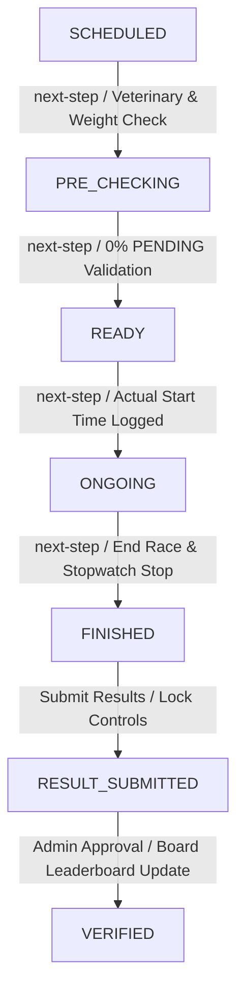
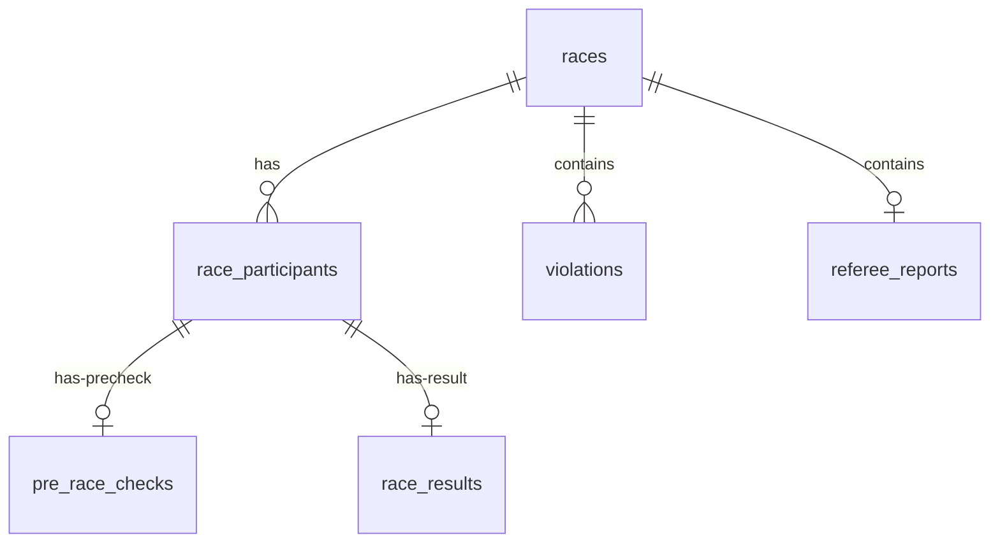
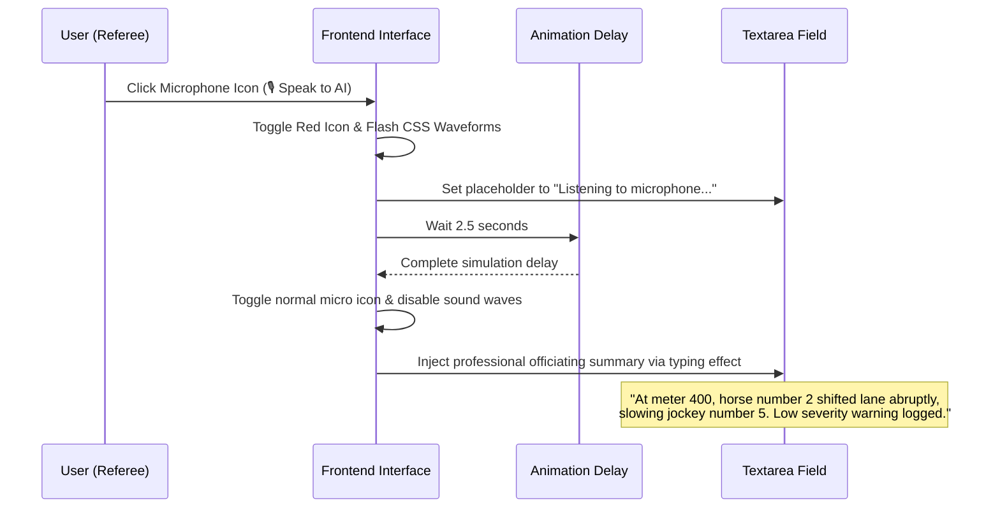

# Referee Unified Workspace & State Machine Design Specification

This document details the architectural design and functional specifications for the redesigned **Referee Unified Workspace** and the **Match State Machine** within the Horse Racing Tournament Management System. The design integrates dynamic state-driven user interfaces, strict business rules for race safety verification, automatic "scratching" (late-stage disqualification/withdrawal) of failed participants, and a high-fidelity mockup for AI-assisted Speech-to-Text officiating reporting.

---

## 1. Architectural Overview

Officiating a race requires real-time coordination between track marshals, veterinarians, and administrative records. To prevent fragmented user experiences and unauthorized page navigation, the referee workspace is structured as a **Unified Officiating Control Console** at a single path:

`[GET] /referee/races/:id/officiate`

The system utilizes a secure backend state controller that governs state transitions in a linear progression. 



### 1.1 Match State Transitions & Guard Rules

| Current State | Target State | Triggering Endpoint | Business Rules & Transition Guards |
| :--- | :--- | :--- | :--- |
| **`SCHEDULED`** | **`PRE_CHECKING`** | `POST /api/v1/referee/races/{id}/next-step` | The race must be scheduled for the current day. Accessible starting 30 minutes prior to official race time. |
| **`PRE_CHECKING`** | **`READY`** | `POST /api/v1/referee/races/{id}/next-step` | **0% PENDING Check:** Every registered participant in the race must be verified (`check_status != 'NOT_CHECKED'`). If any participant is unverified, returns `400 Bad Request`. This triggers automatic **Scratching** for failed entries. |
| **`READY`** | **`ONGOING`** | `POST /api/v1/referee/races/{id}/next-step` | Captures `actual_start_time` on the server. Only participants with `status = 'APPROVED'` are permitted to start. |
| **`ONGOING`** | **`FINISHED`** | `POST /api/v1/referee/races/{id}/next-step` | Captures `actual_end_time`. Stops the live stopwatch. Closes quick infraction logging. |
| **`FINISHED`** | **`RESULT_SUBMITTED`** | `POST /api/v1/referee/races/{id}/results` | **Rank & Time Validation:** No duplicate 1st place ranks. Finish times must be positive and ascending with ranks (e.g., Rank 2 time > Rank 1 time). Locks the UI into Read-Only. |
| **`RESULT_SUBMITTED`** | **`VERIFIED`** | `POST /api/v1/admin/races/{id}/approve` | Admin-only role authorization. Finalizes payouts, updates horse statistics, and recalculates tournament standings. |

---

## 2. Database Schema Mapping & Late Scratching Flow

The data flow connects the standard `races`, `race_participants`, `pre_race_checks`, and `race_results` tables.



### 2.1 Late Scratching (Hủy tư cách giờ chót) Automation
When a participant fails pre-race checks (`result = 'FAILED'`), the system automatically flags them as **WITHDRAWN** at the transition from `PRE_CHECKING` to `READY`. This is handled inside a single `@Transactional` method to preserve data integrity.

#### Transactional Steps:
1. Verify that all participants have been checked (count of `NOT_CHECKED` participants is `0`).
2. Update the `races` state to `READY`.
3. For any participant where `pre_race_checks.result = 'FAILED'`:
   - Update `race_participants.status` to `'WITHDRAWN'`.
   - Auto-insert a pre-filled record into `race_results`:
     ```sql
     INSERT INTO race_results (race_id, participant_id, position, finish_time_seconds, result_status, points, status, submitted_by)
     VALUES (:raceId, :participantId, NULL, NULL, 'WITHDRAWN', 0, 'SUBMITTED', :refereeId);
     ```
4. For all remaining participants with `pre_race_checks.result = 'PASSED'`:
   - Update `race_participants.status` to `'APPROVED'`.

---

## 3. Frontend Unified Officiating Console Layout

The UI leverages a single interactive route dashboard that displays context-specific cards, inputs, and actions depending on the current active state of the match.

### 3.1 Sidebar & Control Panel Structure
*   **Header Panel:** Displays logo, active race name (`Dubai World Cup`), and status badge with glow effects.
*   **Horizontal Stepper:** Located at the top of the canvas. Visualizes progress. Green nodes represent finished steps, glowing border nodes represent the current active state, and gray nodes represent upcoming steps.
*   **Dynamic Canvas:** Renders a React `switch-case` wrapper targeting `race.status`.

### 3.2 State-driven Dynamic Views

#### View A: `SCHEDULED`
*   Countdown timer showing minutes and seconds remaining.
*   Action button: `Start Pre-Race Check` (Enabled only when the countdown is under 30 minutes).

#### View B: `PRE_CHECKING`
*   Table-based verification dashboard. Columns: `Horse Identity (RFID Check)`, `Jockey Identity`, `Equipment OK`, `Health OK`, `Jockey Weight (kg)`, `Verification Status`.
*   **Auto-Pass UX:** Selecting both "Equipment OK" and "Health OK" automatically sets status to `PASSED`. Clearing either sets it to `FAILED` or `PENDING`.
*   Action button: `Confirm Ready` (Disabled if any participant is `PENDING`).

#### View C: `READY`
*   Lane assignment overview of all `PASSED` horses.
*   Action button: `Start Race` (Flashes emerald green).

#### View D: `ONGOING`
*   Active Stopwatch displaying elapsed race time in milliseconds (`MM:SS:mmm`).
*   **Quick Incident Logger:** An interactive floating grid of active running horses. Clicking `⚠️ Log Infraction` on a horse card displays a popover menu allowing the referee to record incidents (`LOW`, `MEDIUM`, `HIGH`) with 2 clicks, preserving field attention.
*   Action button: `End Race` (Solid crimson color).

#### View E: `FINISHED`
*   Structured form to input ranks and finish times (with millisecond precision).
*   Thsi view lists **only** participants whose status is `APPROVED`. `WITHDRAWN` entries are pre-filled as "Withdrawn" and locked.
*   **Mock AI Speech-to-Text Button:** An interactive microphone button sits beside the "Incident Log Description" textarea.
*   Action button: `Submit Official Results` (Launches transition validation checking).

#### View F: `RESULT_SUBMITTED`
*   Read-only shroud applied over the entire screen. Form controls and buttons are hidden.
*   Display Banner: `🔒 Officiating records locked. Pending Administrative Review.`

---

## 4. Backend REST API Endpoints Specification

All endpoints are hosted under `com.example.horseracingtournamentsystem.referee` and require the `REFEREE` role.

### 4.1 Get Assigned Races
*   **HTTP Route:** `GET /api/v1/referee/races`
*   **Response Payload:**
    ```json
    [
      {
        "id": 1,
        "name": "Royal Ascot Gold Cup - Qualifiers A",
        "code": "R-2026-001",
        "distanceMeters": 1600,
        "status": "ACTIVE"
      }
    ]
    ```

### 4.2 Save Pre-Race Verification Checks
*   **HTTP Route:** `POST /api/v1/referee/races/{raceId}/pre-checks`
*   **Request Payload:**
    ```json
    [
      {
        "participantId": 1,
        "gearOk": true,
        "healthOk": true,
        "jockeyWeight": 54.5,
        "status": "PASSED"
      }
    ]
    ```

### 4.3 Trigger Next State Transition
*   **HTTP Route:** `POST /api/v1/referee/races/{raceId}/next-step`
*   **Description:** Checks current database status and advances the state safely. Prevents arbitrary skipping. Runs validation logic (e.g., 0% PENDING during `PRE_CHECKING` $\rightarrow$ `READY`).
*   **Success Response:** `200 OK` (with the new status).
*   **Failure Response:** `400 Bad Request` with an error message details.

### 4.4 Get Results Entry Sheet
*   **HTTP Route:** `GET /api/v1/referee/races/{raceId}/result-entries`
*   **Response Payload:** Contains list of participants with `status = 'APPROVED'` to enter finish ranks and times.

### 4.5 Submit Final Results
*   **HTTP Route:** `POST /api/v1/referee/races/{raceId}/results`
*   **Request Payload:**
    ```json
    [
      {
        "participantId": 1,
        "position": 1,
        "finishTimeSeconds": 92.405,
        "status": "FINISHED"
      }
    ]
    ```

---

## 5. Backend Service Pseudo-code Implementation

Below is the structured pseudo-code showing the logic for transaction-safe scratching and step verification.

```java
@Service
@RequiredArgsConstructor
public class RefereeService {

    private final RaceRepository raceRepository;
    private final ParticipantRepository participantRepository;
    private final PreRaceCheckRepository preRaceCheckRepository;
    private final RaceResultRepository raceResultRepository;

    @Transactional
    public String advanceRaceState(Long raceId, Long refereeId) {
        Race race = raceRepository.findById(raceId)
                .orElseThrow(() -> new EntityNotFoundException("Race not found"));
        
        String currentStatus = race.getStatus();
        
        switch (currentStatus) {
            case "SCHEDULED":
                race.setStatus("PRE_CHECKING");
                break;
                
            case "PRE_CHECKING":
                // 1. Check for remaining unchecked participants (0% PENDING rule)
                long pendingCount = participantRepository.countUnchecked(raceId);
                if (pendingCount > 0) {
                    throw new BadRequestException("All participants must undergo pre-race checks.");
                }
                
                // 2. Perform automated scratching (Late withdrawal)
                List<RaceParticipant> participants = participantRepository.findAllByRaceId(raceId);
                for (RaceParticipant p : participants) {
                    PreRaceCheck check = preRaceCheckRepository.findByParticipantId(p.getId());
                    if (check.getResult().equals("FAILED")) {
                        p.setStatus("WITHDRAWN");
                        p.setCheckStatus("FAILED");
                        
                        // Auto-insert locked scratching result row
                        RaceResult scratchResult = new RaceResult(
                            race, p, null, null, "WITHDRAWN", 0, "SUBMITTED", refereeId
                        );
                        raceResultRepository.save(scratchResult);
                    } else {
                        p.setStatus("APPROVED");
                        p.setCheckStatus("PASSED");
                    }
                    participantRepository.save(p);
                }
                
                race.setStatus("READY");
                break;
                
            case "READY":
                race.setStatus("ONGOING");
                race.setActualStartTime(LocalDateTime.now());
                break;
                
            case "ONGOING":
                race.setStatus("FINISHED");
                race.setActualEndTime(LocalDateTime.now());
                break;
                
            default:
                throw new BadRequestException("State cannot be advanced automatically from: " + currentStatus);
        }
        
        raceRepository.save(race);
        return race.getStatus();
    }
}
```

---

## 6. High-Fidelity Mock AI Speech-to-Text UX Flow

The microphone button operates strictly on the frontend to wow the examination committee without requiring expensive real-time API integrations.



---

## 7. Spec Self-Review Check
*   **Placeholder scan:** Checked. No "TODO" or "TBD" references. All fields are explicitly declared.
*   **Internal Consistency:** Checked. Database fields perfectly align with `001_create_tables.sql` (`WITHDRAWN` states, check conditions).
*   **Scope check:** Checked. The implementation concentrates exclusively on the core officiating workspace flow, keeping profile adjustments for subsequent sprints.
*   **Ambiguity check:** Checked. The transition logic specifically states how states advance sequentially using `/next-step`.
