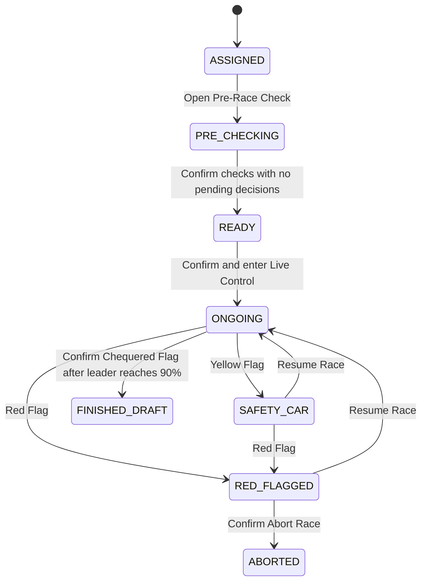

# Referee Race-Day Operations Frontend Design

## 1. Scope

This sprint delivers an API-ready frontend vertical slice for referee race-day operations:

`Assigned Race -> Pre-Race Check -> Ready Lineup -> Live Race -> Finished Draft Summary`

The frontend uses mock telemetry and frontend state for the simulator. It does not add WebSocket integration or implement post-race adjudication. Dynamic result sorting, photo-finish overrides, complaints, draft updates, and the publish gate belong to the next sprint.

The implementation extends the existing unified referee workspace at:

`/referee/races/:id/officiate`

## 2. Design Direction

Use the staged operations workspace as the master layout. The screen changes its visible regions based on the race state instead of navigating through separate pages.

### 2.1 Assigned Race

The default referee landing view is a day timeline because time is the primary operational concern on race day.

- Display assigned races along a vertical daily timeline.
- Show race time, countdown, venue, distance, and status on each timeline card.
- Add a current-time indicator.
- Allow toggling between the default day timeline and a secondary month calendar.
- Open a side drawer when a referee selects a race.
- Display race details and the `Open Pre-Race Check` action in the drawer.

### 2.2 Pre-Race Check

When the referee opens pre-race checking:

- Keep the timeline visible on the left.
- Slide the detail drawer out.
- Replace the drawer region with an expanded participant checklist.
- Display horse identity, jockey, equipment check, health check, and verification status.
- Use the visible statuses `PASSED`, `CHECK HEALTH`, and `SCRATCHED`.
- Disable confirmation while any participant still needs a decision.

### 2.3 Ready Lineup

After the referee confirms checks:

- Show a short lineup summary containing only eligible runners.
- Exclude scratched horses.
- Require explicit confirmation before entering the live control room.

### 2.4 Live Race

When live operations begin:

- Hide the timeline and checklist.
- Expand the live workspace to the full available content area.
- Place the simulator monitor on the left.
- Place the active leaderboard and the `Out of Race` list on the right.
- Place the incident log and flag controls along the bottom.
- Reveal penalty hotkeys for the selected leaderboard row.

### 2.5 Finished Draft Summary

When the referee confirms the Chequered Flag:

- Freeze the simulator.
- Capture a draft result snapshot.
- Show elapsed time, the draft Top 3, and incident history.
- End the sprint workflow at this summary state.

## 3. Domain Rules

### 3.1 Runner Statuses

| Status | Meaning | Live Leaderboard Behavior |
| :--- | :--- | :--- |
| `PASSED` | Cleared during pre-race verification | Included in live simulator and leaderboard |
| `SCRATCHED` | Removed before the race, such as a failed health check | Never added to live simulator or leaderboard |
| `DNS` | Cleared pre-race but did not start | Removed from active runners and retained in audit data |
| `DNF` | Started but did not finish | Moved out of active competition and retained in audit data |
| `DSQ` | Disqualified during or after the race | Moved into `Out of Race` with final telemetry retained |

`SCRATCHED` is the primary pre-race removal status. It must remain distinct from `DNS` because the operational meaning and future settlement rules differ.

### 3.2 Pre-Race Time Guard

Production rule:

- The race must be scheduled for the current day.
- `Open Pre-Race Check` unlocks during the 60-minute window before the scheduled start time.

Demo Mode:

- Defaults to `OFF`.
- Can be toggled from the assigned race timeline header.
- Bypasses only the 60-minute time window.
- Still requires the race to be scheduled for the current day.
- Displays a visible warning badge: `Demo Mode Active - Time Guard Bypassed`.

Store the guard values in frontend config so a backend rule can replace the mock decision later.

### 3.3 Live Flag Controls

| Control | Simulator Behavior | Incident Log |
| :--- | :--- | :--- |
| Green Flag | Start or resume normal racing speed | Record start or resume |
| Yellow Flag / Safety Car | Reduce all speeds uniformly and lock ordering so runners cannot overtake | Record Safety Car deployment |
| Resume after Yellow | Restore normal racing speed and release the ordering lock | Record Safety Car end |
| Red Flag | Freeze runner progress and pause live movement | Record emergency stop |
| Resume after Red | Restore the state active before the stop | Record resume |
| Abort after Red | End the race as aborted after confirmation | Record abort |
| Chequered Flag | Freeze live state and create a finished draft snapshot | Record finish |

The Chequered Flag stays disabled until the leader reaches at least `90%` progress. When enabled, it still requires confirmation before snapshot creation.

### 3.4 Live Penalties

Selecting a live leaderboard row reveals runner-specific hotkeys:

- `Warning`: add an incident log entry.
- `+5s`: add an incident and a draft penalty record. Do not alter live track order.
- `DSQ`: freeze the runner's final telemetry, remove the runner from the active leaderboard, and move the row into `Out of Race`.

The active leaderboard always represents physical track position. Penalty-based reordering belongs to post-race adjudication.

## 4. API-Ready Frontend Models

The mock adapter should expose models that can later map to backend endpoints without reshaping UI components.

```ts
type AssignedRace = {
  id: number;
  code: string;
  name: string;
  scheduledAt: string;
  venue: string;
  distanceMeters: number;
  status: RaceDayStage;
};

type PreRaceParticipant = {
  participantId: number;
  horseName: string;
  jockeyName: string;
  equipmentOk: boolean;
  healthOk: boolean;
  status: "CHECK_HEALTH" | "PASSED" | "SCRATCHED";
  scratchedReason?: string;
};

type LiveRunner = {
  participantId: number;
  horseName: string;
  gateNumber: number;
  progressPercent: number;
  speedMultiplier: number;
  status: "RUNNING" | "DNS" | "DNF" | "DSQ";
};

type RaceIncident = {
  id: string;
  occurredAt: string;
  type: "FLAG" | "WARNING" | "PENALTY" | "DSQ";
  participantId?: number;
  message: string;
  penaltySeconds?: number;
};

type RaceSnapshot = {
  raceId: number;
  elapsedMilliseconds: number;
  leaderboard: LiveRunner[];
  outOfRace: LiveRunner[];
  incidents: RaceIncident[];
};
```

## 5. Frontend Structure

The current `RefereeOfficiatePage.tsx` is large. The implementation should keep the route container focused on orchestration and move stage UI into smaller components.

| Module | Responsibility |
| :--- | :--- |
| `RefereeOverviewPage` | Assigned race timeline, calendar toggle, current-time indicator, and Demo Mode |
| `RaceDetailDrawer` | Selected race details, guard explanation, and pre-race entry action |
| `PreRaceChecklist` | Participant checks and scratch decisions |
| `ReadyLineupPanel` | Eligible runner review before live entry |
| `LiveRaceWorkspace` | Full live layout composition |
| `RaceSimulator` | Mock telemetry loop and flag effects |
| `LiveLeaderboard` | Active ordering, selected-runner hotkeys, and `Out of Race` |
| `LiveIncidentLog` | Timestamped operational history |
| `RaceSummary` | Frozen draft snapshot |
| `refereeRaceDayConfig.ts` | Guard window, finish threshold, and simulator constants |
| `refereeRaceDayModels.ts` | API-ready frontend types |

## 6. State Flow



## 7. Error Handling

- Replace silent API failures with an error state and retry action.
- Disable pre-race confirmation while any participant remains `CHECK_HEALTH`.
- Prevent entering live operations when no eligible runners remain.
- Require confirmation for `Abort Race` and `Chequered Flag`.
- Write every flag transition, warning, penalty, and DSQ action to the incident log.
- Keep the latest valid telemetry when a runner becomes `DSQ`.

## 8. Test Coverage

Frontend behavioral tests should cover:

1. The overview defaults to day timeline and can toggle to month calendar.
2. The selected race opens a side drawer.
3. Production Mode enforces the same-day and 60-minute guard.
4. Demo Mode bypasses only the 60-minute guard.
5. Failed health verification converts a participant to `SCRATCHED`.
6. `SCRATCHED` participants do not appear in live simulator data or the active leaderboard.
7. Yellow Flag reduces speed, preserves movement, and prevents overtaking.
8. Red Flag freezes progress and exposes resume and abort actions.
9. `+5s` logs a draft penalty without changing live track order.
10. `DSQ` moves a runner into `Out of Race` and retains final telemetry.
11. Chequered Flag is locked before the leader reaches `90%`.
12. Confirming Chequered Flag creates and displays the finished draft summary.

## 9. Deferred Post-Race Sprint

The next sprint owns:

- importing the draft snapshot,
- penalty calculation and animated result reordering,
- displaying `raw time + penalty time = final time`,
- manual timing override after photo-finish review,
- preserving original rank badges,
- real-time complaints,
- accept/reject complaint actions,
- and unlocking `Publish Result` only after no complaint remains pending.

## 10. Self-Review

- Placeholder scan: no incomplete requirements remain.
- Consistency check: live ordering remains physical ordering; penalties are deferred to post-race sorting.
- Scope check: this document contains only Assigned Race, Pre-Race, Ready, Live Race, and Finished Draft Summary.
- Ambiguity check: `SCRATCHED`, `DNS`, `DNF`, and `DSQ` have distinct meanings and behaviors.
